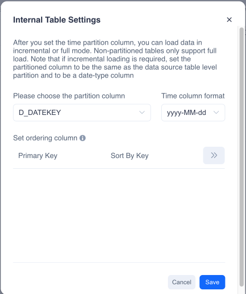
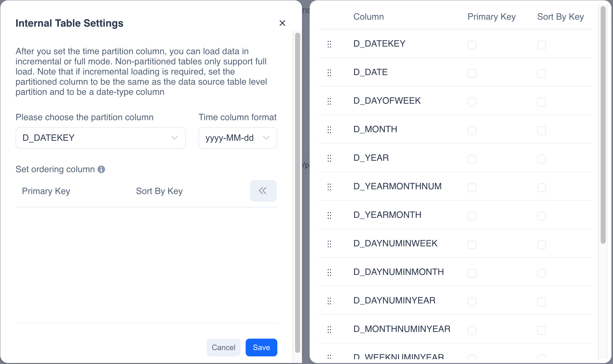

### 1. **Creating Internal Tables**

Kylin does not currently support the creation of internal tables through SQL DDL statements.

You can currently create internal tables in two ways:

1. When importing a data source table, check the option "Load as Internal Table." This method is suitable for batch creation of internal tables while initially importing the data source table.

:::info Note
When creating internal tables in batch, the system will not set partition columns or other information by default. If you need to set partition columns, sort columns, etc. please update them later on the internal table management page.
:::

2. Click the "Create Internal Table" button on the page of the imported data source table and complete the relevant table property settings to finish creating the internal table.

### 2. **Setting Internal Table Properties**

**Setting Partition Columns**

Internal tables support the setting of partition columns to enhance query performance in certain scenarios. You can set a column in the table as a partition column, which can be a date column or a non-date column. However, please note that incremental loading of internal tables is only possible when the partition column is a date column.
When the internal table does not contain a partition column or the partition column is a non-date column, only full loading is supported.
We strongly recommend avoiding setting high cardinality columns as partition columns, as generating too many data partitions may negatively impact query performance.

**Setting PrimaryKey and OrderByKey**

Setting primary key columns and order by columns can enhance query performance in certain scenarios. Unlike traditional RDBMS, the primary key column here is not a unique key constraint but is only used to accelerate queries where the column is filtered in a where clause.
It should be noted that the primary key column must be the prefix column of the order by column.

You can click on " >> " to set the primaryKey and the orderByKey.

### 3. **Updating Internal Table Properties**

You can update table properties on the internal table management page.
Note: Since internal table properties affect the storage distribution of table data, you cannot change partition columns and other table property information after data is imported.
You need to clear all internal table data before making modifications.

### 4. **Table Reloading**

If you reload a data source table, the internal table will also be reloaded. However, table reloading cannot be performed when the internal table contains data; you need to clear the table data first.

### 5. **Clearing Table Data**

You can clear the data of an internal table on the internal table management page. Executing the clear table data operation will also terminate all running data import tasks for that table.

### 6. **Deleting Internal Tables**

You can delete internal tables on the internal table management page. Executing the delete internal table operation will also clear the internal table data and stop any running data import tasks.
