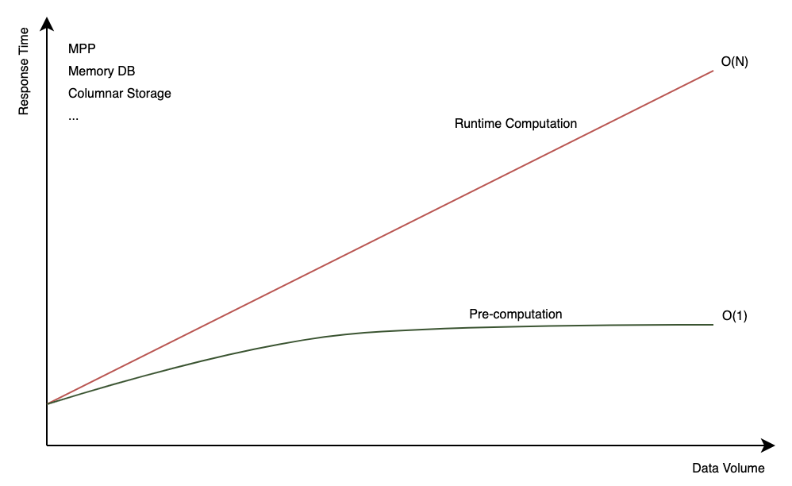

### Introduction

Kylin utilizes multidimensional modeling theory to build star or snowflake schemas based on tables, making it a powerful tool for large-scale data analysis. The **model** is Kylin's core component, consisting of three key aspects: *model design*, *index design*, and *data loading*. By carefully designing the model, optimizing indexes, and pre-computed data, queries executed on Kylin can avoid scanning the entire dataset, potentially reducing response times to mere seconds, even for petabyte-scale data.

+ **Model design** refers to establishing relationships between data tables to enable fast extraction of key information from multidimensional data. The core elements of model design are computed columns, dimensions, measures, and join relations.

+ **Index design** refers to creating indexes (CUBEs) within the model to precompute query results, thereby reducing query response time. Well-designed indexes not only improve query performance but also help minimize the storage and data-loading costs associated with precomputation.

+ **Data loading** refers to the process of importing data into the model, enabling queries to utilize the pre-built indexes rather than scanning the entire dataset. This allows for faster query responses by leveraging the model's optimized structure.

### Core Concepts

- **Dimension**: A perspective of viewing data, which can be used to describe object attributes or characteristics, for example, product category.

- **Measure**: An aggregated sum, which is usually a continuous value, for example, product sales.

- **Pre-computation**: The process of aggregating data based on model dimension combinations and of storing the results as indexes to accelerate data query.

- **Index**: Also called CUBE, which is used to accelerate data query. Indexes are divided into:
    - **Aggregate Index**: An aggregated combination of multiple dimensions and measures, and can be used to answer aggregate queries such as total sales for a given year.
    - **Table Index**: A multilevel index in a wide table and can be used to answer detailed queries such as the last 100 transactions of a certain user.

### Why Use Kylin

+ **Low Query Latency vs. Large Volume**

  When analyzing massive data, there are some techniques to speed up computing and storage, but they cannot change the time complexity of query, that is, query latency and data volume are linearly dependent.

  If it takes 1 minute to query 100 million entries of data records, querying 10 billion data entries will take about 1 hour and 40 minutes. When companies want to analyze all business data piled up over the years or to add complexity to query, say, with more dimensions, queries will be running extremely slow or even time out.

  

+ **Pre-computation vs. Runtime Computation**

  Pre-computation and runtime computation are two approaches to calculating results in data processing and analytics. **Pre-computation** involves calculating and storing results in advance, so they can be quickly retrieved when a query is run. In contrast, **runtime computation** dynamically computes results during query execution, processing raw data and applying aggregations, filters, or transformations as needed for each query.

  Kylin primarily focuses on **pre-computation** to enhance query performance. However, we also offer advanced features that partially support runtime computation. For more details, please refer to [Table Snapshot](snapshot/snapshot.md), [Runtime Join](features/runtime_join.md), and [Internal Table](../internaltable/intro.md).  

+ **Manual Modeling vs. Recommendation**

  Before Kylin 5.0, model design had to be done manually, which was a tedious process requiring extensive knowledge of multidimensional modeling. However, this changed with the introduction of Kylin 5.0. We now offer a new approach to model design, called **recommendation**, which allows models to be created by importing SQL, along with an automatic way to remove unnecessary indexes. Additionally, the system can leverage query history to generate index recommendations, further optimizing query performance. For more details, please refer to [Recommendation](rec/intro.md).

+ **Batch Data vs. Streaming Data**

  In the OLAP field, data has traditionally been processed in batches. However, this is changing as more companies are now required to handle both batch and streaming data to meet their business objectives. The ability to process data in real-time has become increasingly critical for applications such as real-time analytics, monitoring, and event-driven decision-making.

  To address these evolving needs, we have introduced support for streaming data in the new version. This allows users to efficiently process and analyze data as it is generated, complementing the traditional batch processing capabilities. For more details, please refer to [Streaming](streaming/intro.md).
