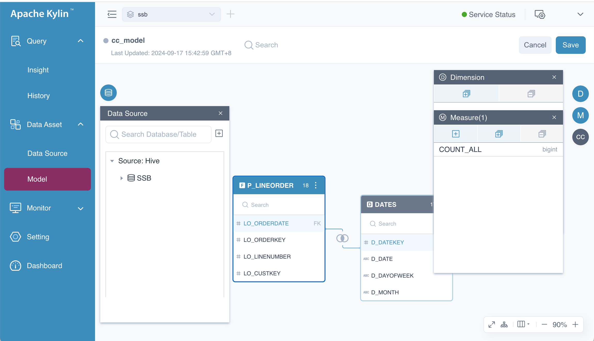
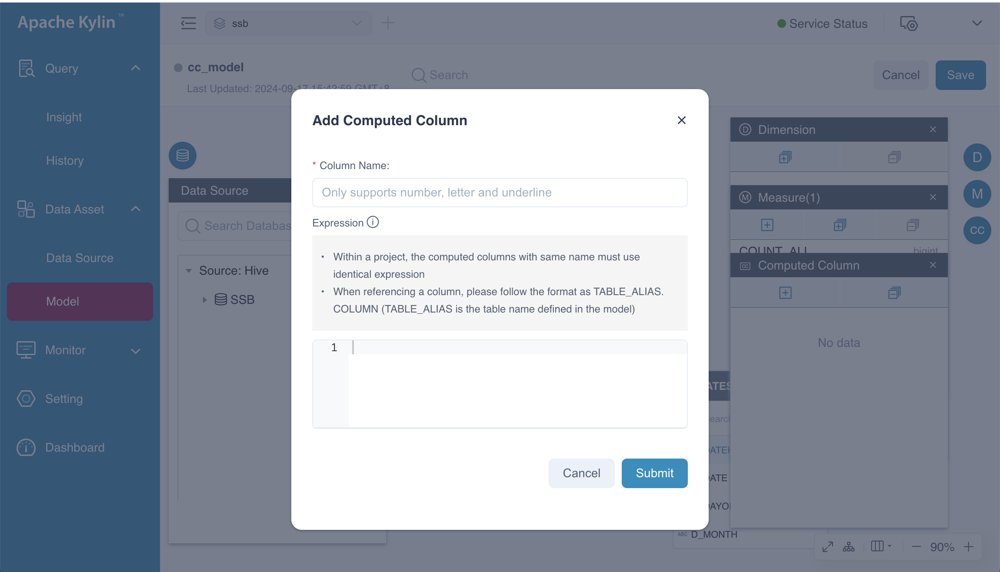
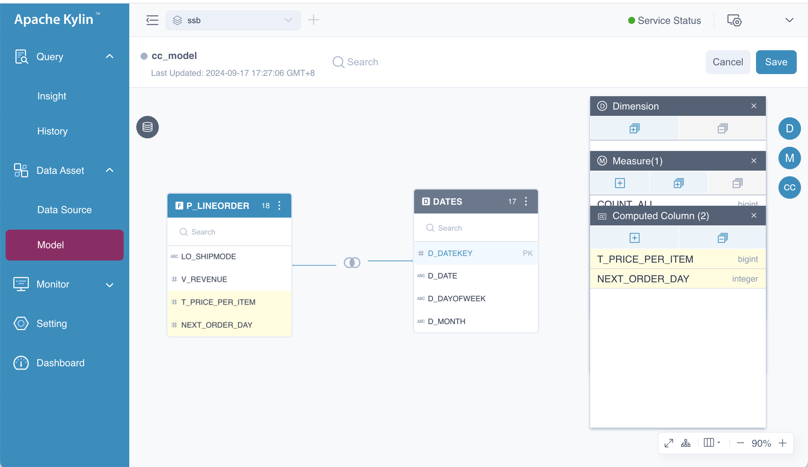
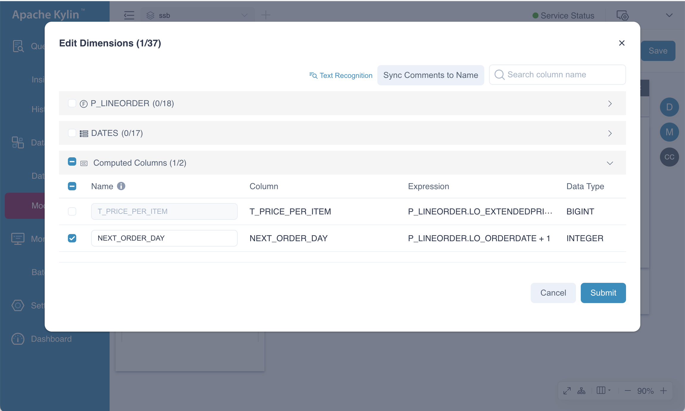
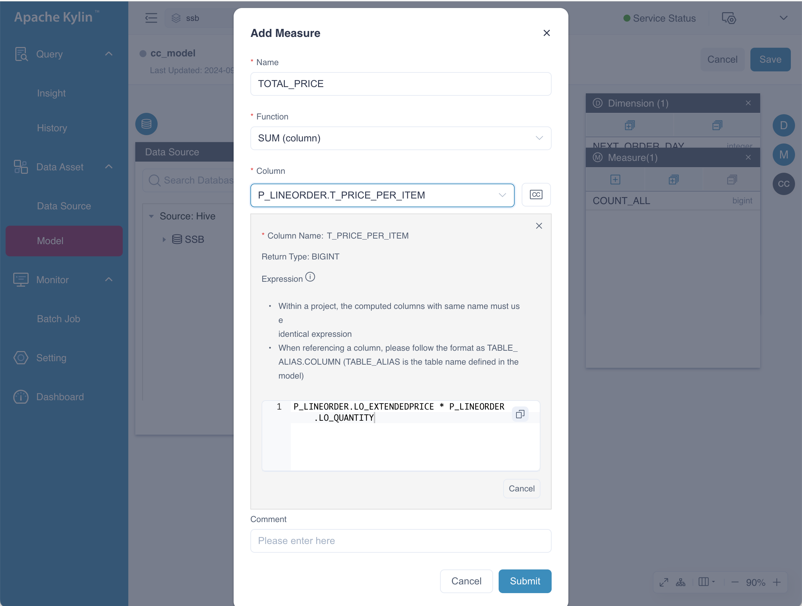
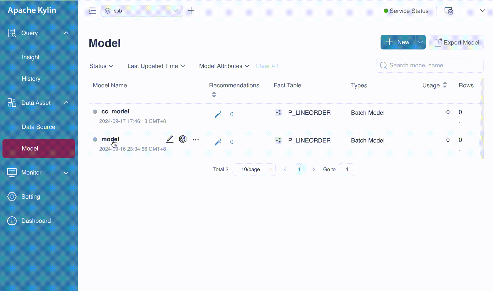
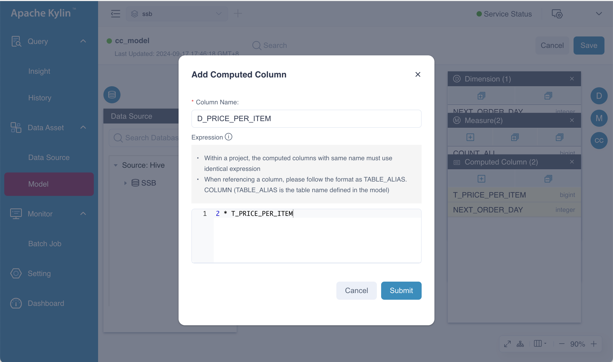

A **Computed Column** allows you to define actions such as data transformation and calculations directly within your models. This feature enhances data semantic abstraction tailored to various business scenarios. By shifting runtime calculations to offline index construction, Kylin effectively leverages its pre-calculation capabilities, resulting in significantly improved query performance. Additionally, computed columns support Hive UDFs, enabling the reuse of existing business logic and code.

### <span id="concept">Basic Concepts</span>

- **Naming Convention**: Computed column names may only include letters, digits, and underscores. Names cannot consist solely of digits or start with an underscore.

- **Expression**: This refers to the logic used for calculations. The expression for a computed column can incorporate columns from both the fact table and a lookup table within the current model.

- **Reuse and Reference**:
    - Computed columns are tied to a specific model and fact table, meaning one expression cannot create multiple computed columns across different models with varying names.
    - Strictly speaking, computed columns cannot be reused across models in the same project. To reuse a computed column in another model, you must define a new computed column with the same name and expression.
    - Nested computed columns are supported, allowing you to utilize existing computed columns to create new ones.

    - A single expression cannot generate multiple computed columns across different models that share the same fact table. For example, if you have two models, *model1* and *model2*, both using the fact table *LINEORDER*, and you wish to use the expression *LINEORDER.PRICE * LINEORDER.QUANTITY* to create computed columns in both models, the system will require you to use the same name, such as *T_PRICE*. Additionally, the name *T_PRICE* cannot be used for any other expressions within these models.

      :::tip Tips
        - Computed columns can only be defined on the fact table. Once created, only the column expression can be modified.
        - Avoid naming conflicts with other columns to prevent unexpected errors.
        - Aggregate functions such as *SUM*, *MIN*, *MAX*, etc., are not permitted in computed column expressions.
        - Creating a computed column with an expression that consists solely of constants is not recommended, such as *POWER(CAST(2 AS DOUBLE), 2)*.
        - Avoid using keywords in computed column expressions. Refer to the [SQL Specification](../../query/specification/sql_spec.md) for a list of keywords.
        - If an expression references identifiers that start with non-letter characters or include special characters, enclose the name in double quotes. For example: *"KYLIN_SALES"."100_PRICE" * "1_KYLIN_SALES"."ITEM_COUNT"*.
          :::

### <span id="create">Create</span>

To help you master the creation of a computed column, we will demonstrate an example scenario below. Assume you have a fact table named *P_LINEORDER* with the following columns:

- *LO_EXTENDEDPRICE*: Transaction price
- *LO_QUANTITY*: Transaction quantity
- *LO_ORDERDATE*: Transaction date

We want to define two computed columns on this fact table: *T_PRICE_PER_ITEM* to calculate the total transaction price for each item, and *YEAR_OF_ORDER* to indicate the year of the order. The corresponding expressions are as follows:

- *T_PRICE_PER_ITEM* ::= *P_LINEORDER.LO_EXTENDEDPRICE * P_LINEORDER.LO_QUANTITY*
- *NEXT_ORDER_DAY* ::= *P_LINEORDER.LO_ORDERDATE + 1*

**Step 1**: Click the button  marked in the picture. A window for **Computed Column** will pop up.



**Step 2**: Click the button  in this window, and a dialog box titled **Add Computed Column** will appear. Please fill in the following information:

- *Column name*: Defines the name of the computed column.
- *Expression*: Specifies the calculation logic for the column.



**Step 3**: Click the **Submit** button. The system will verify the legality of the name and expression of the computed column. If any issues arise, the system will provide feedback, allowing you to correct it and resubmit. Once the computed column is created, it will be visible in the fact table. For example, *T_PRICE_PER_ITEM* will appear in the fact table *P_LINEORDER*.



**Step 4**: After creating the computed column, click the button  in the **Dimension** window to add a new dimension based on the computed column *NEXT_ORDER_DAY*, as shown below:



Additionally, click the button  in the **Measure** window to add a new measure, *TOTAL_PRICE*, based on the computed column *T_PRICE_PER_ITEM*, as illustrated below:



### <span id="edit">Modification</span>

In certain situations, it may be necessary to change the expression to adapt to evolving business requirements. You can modify the expressions of computed columns directly by editing the model.


:::note Warning
However, there are a few limitations and considerations to keep in mind. Please review the following limitations carefully before using them:
- Modifying the name of a computed column is not supported.
- Modifying nested computed columns is not allowed. If a computed column has been utilized as a nested computed column, attempting to modify its expression will result in a failure, accompanied by the message: *model \[model_name\] nested computed column \[column_name\] still contains computed column \[column_name\]*.
- Changes may require rebuilding **related indexes** under the model, prompting a message for user confirmation.
- Changes may cause measures to become invalid, necessitating the deletion of related measures, aggregation groups, and layouts, which will also trigger a message for user confirmation.
:::

### <span id="index">Used in Index</span>

Now that we have defined two computed columns in our model and created a new dimension and a new measure, we can leverage the pre-calculation capabilities of indexes. You can use computed columns in either an aggregate index or a table index. Let's walk through an example.



After a successful submission, we have completed the basic usage of computed columns, including:

- Creating a computed column.
- Creating dimensions and measures based on computed columns.
- Defining computed columns in the index.

### <span id="query">Query</span>

A computed column is logically appended to the table's column list after creation. You can query the computed column as if it were a normal column, provided it is pre-calculated in an index.

To improve query performance with computed columns, ensure that you define them when creating an index.

1. **Query Pushdown**

   If a computed column is not used as a dimension or defined in indices, query performance will not be enhanced. However, if **QUERY PUSHDOWN** is enabled, users can still utilize this computed column. In this scenario, Kylin will analyze and translate the query into a SQL statement that the calculation engine can process.

   For example, if a computed column named *T_PRICE_PER_ITEM* is defined with the expression *LO_EXTENDEDPRICE * LO_QUANTITY*, executing the following SQL:

   ```sql
   SELECT SUM(T_PRICE_PER_ITEM) FROM SSB.P_LINEORDER
   ```

   will be translated to:

   ```sql
   SELECT SUM(LO_EXTENDEDPRICE * LO_QUANTITY) FROM SSB.P_LINEORDER
   ```

   This query will then be pushed down to the calculation engine.

   :::tip Tips
   If you wish to query the computed column, you must supply the complete join relations defined in the model that contains the computed column in your SQL.
   :::

2. **Explicit Query**

   If the name of a computed column appears as a field or a parameter of functions in a SQL statement, this is termed an **Explicit Query**. For example:

   ```sql
   SELECT SUM(T_PRICE_PER_ITEM) FROM SSB.P_LINEORDER
   ```

3. **Implicit Query:**

   If the expression of a computed column appears as a field or a parameter of functions in a SQL statement, this is termed an **Implicit Query**. For example:

   ```sql
   SELECT SUM(LO_EXTENDEDPRICE * LO_QUANTITY) FROM SSB.P_LINEORDER
   ```

   In Kylin 4.x, the expression *LO_EXTENDEDPRICE * LO_QUANTITY* will be converted to *T_PRICE_PER_ITEM*. Consequently, the original query will be translated to:

   ```sql
   SELECT SUM(T_PRICE_PER_ITEM) FROM SSB.P_LINEORDER
   ```

   If the measure *SUM(T_PRICE_PER_ITEM)* has been pre-calculated in an Aggregate Index, query performance will be greatly enhanced.

### <span id="nested">Nested Computed Columns</span>

Computed columns can reference other computed columns as part of their expression, allowing for flexibility in data transformations. This means you can build complex calculations on top of existing ones. However, keep in mind the limitations regarding nested computed columns when modifying them, as detailed in the modification section.




### <span id="faq">Frequently Asked Questions</span>

+ **QA: Can the computed columns be used in joins?**

    Yes, computed columns can be utilized in joins, as long as they are defined in the model and pre-calculated in an index.

+ **QA: What happens if a computed column's expression references a non-existent column?**

    The query will fail, and an error message will indicate that the column does not exist.

+ **QA: Are computed columns supported in all data types?**

    Computed columns are limited to specific data types. Ensure compatibility when defining expressions.

+ **QA: How can I optimize the performance of queries using computed columns?**

    To optimize performance, define computed columns on the model, use them in index and query them in your SQL to leverage pre-calculation benefits.

+ **QA: Can I use UDFs in computed column expressions?**

    Yes, computed columns can utilize Hive UDFs, enabling the reuse of existing business logic.

### <span id="summary">Summary</span>

Computed columns in Kylin provide a powerful mechanism for enhancing data processing and query performance. By understanding their usage, properties, and potential limitations, you can leverage computed columns to optimize your analytics and data transformations effectively.
