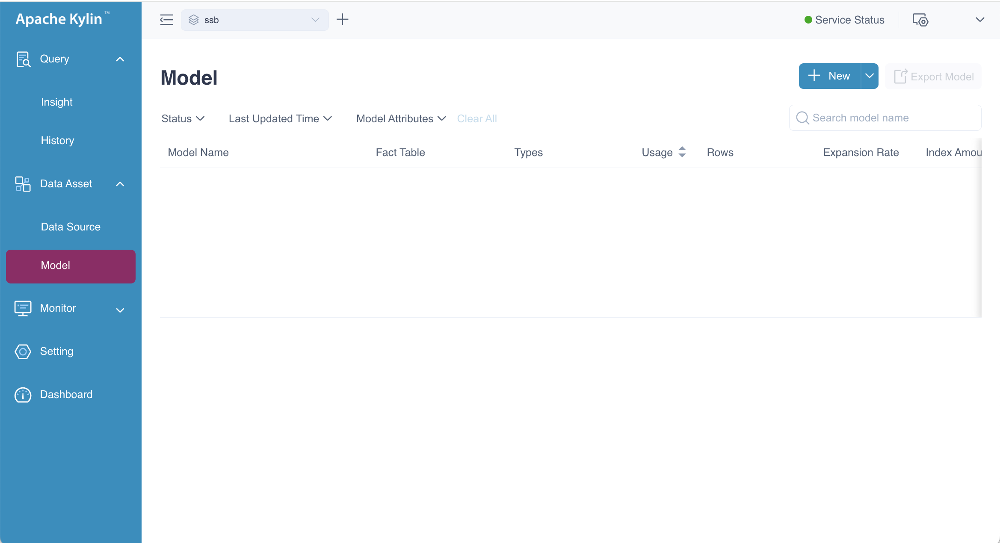
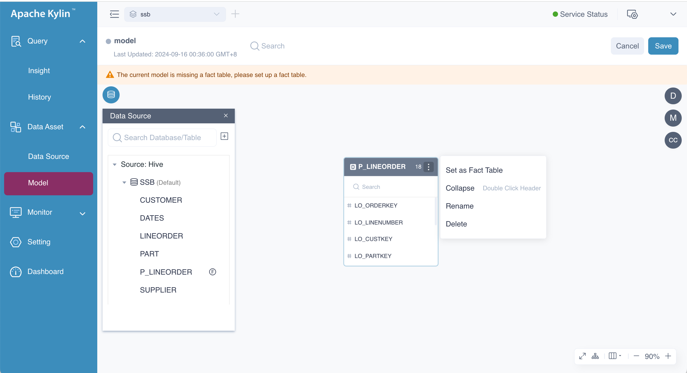
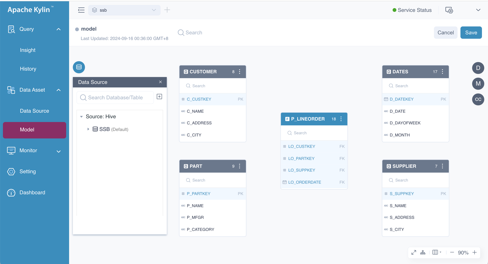
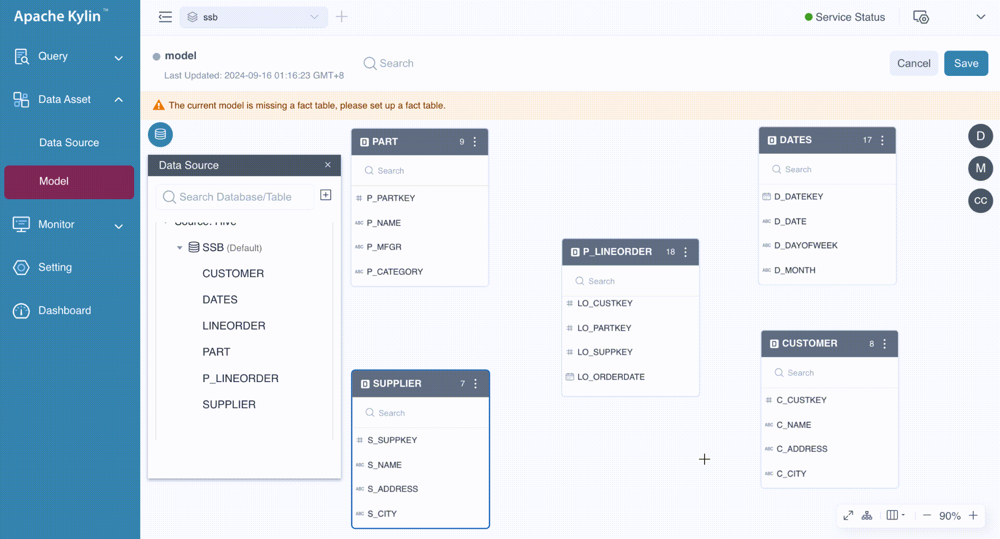
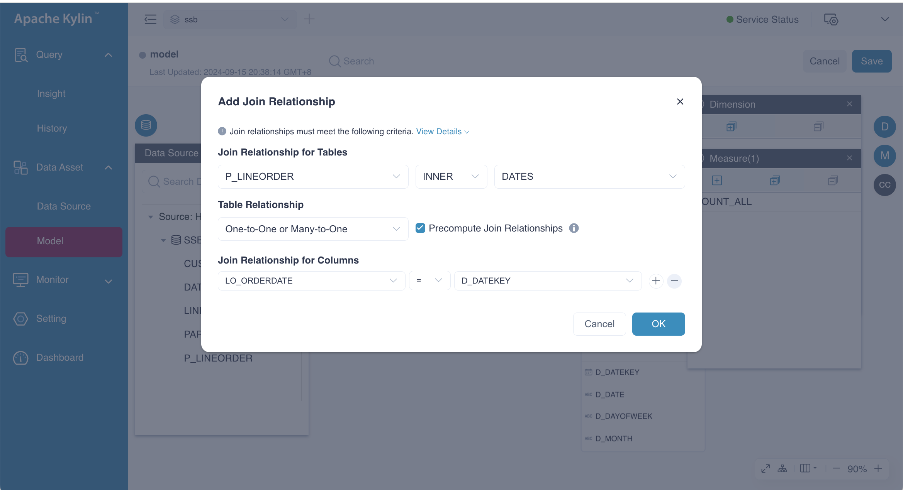
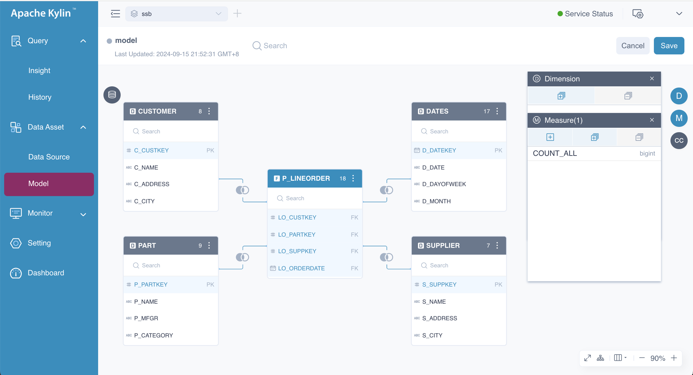
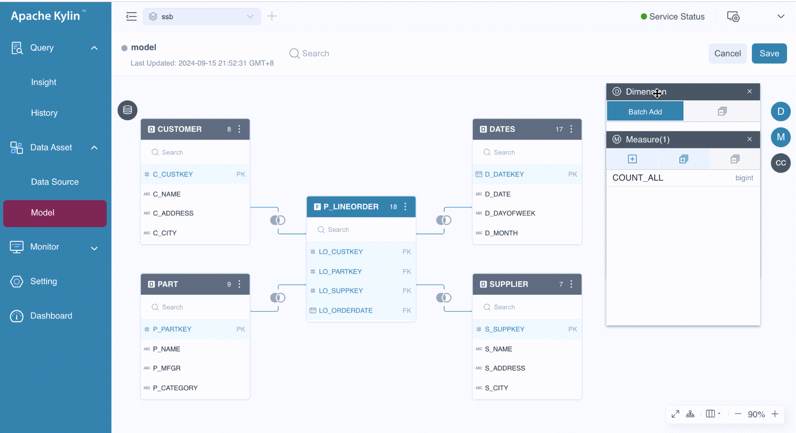
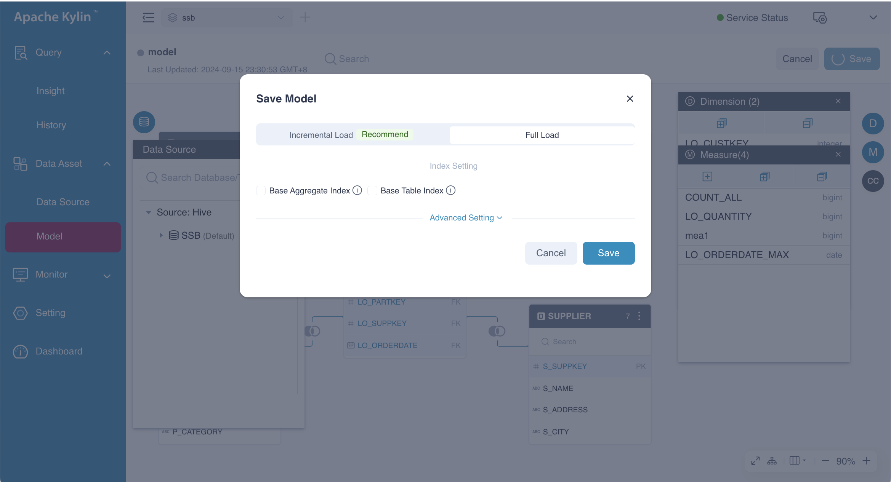
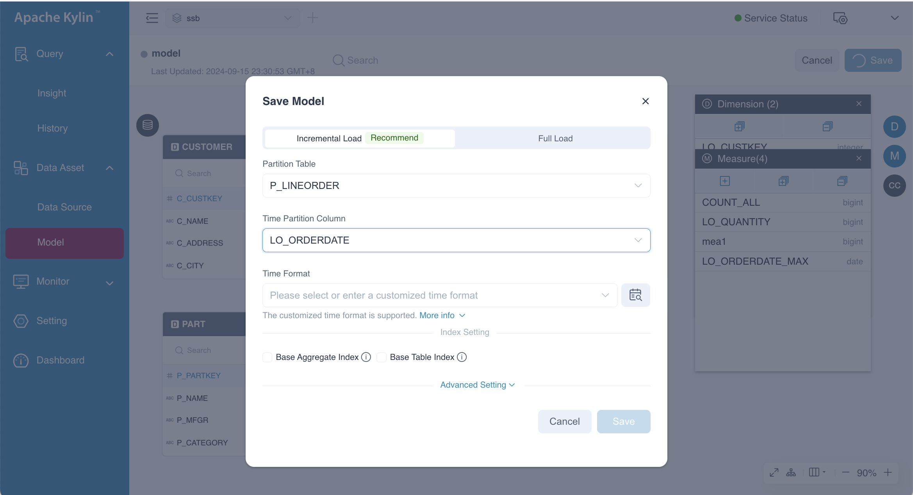
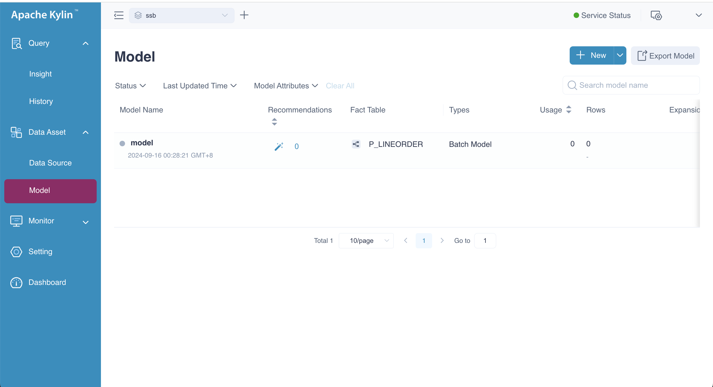

This chapter explains how to design a manual model in Kylin. In this example, we use the [SSB dataset](../../quickstart/tutorial.md), which is based on real-world business applications, to analyze product and supplier information across various dimensions such as *year*, *city*, *supplier*, and *brand*.

Before starting, ensure that you have created a project and loaded tables from the data source. If you haven't done so yet, please refer to the [Quickstart](../../quickstart/intro.md) chapter for detailed instructions.

### Overview

First, we will outline some key operations to ensure you have a clear understanding of the manual modeling process. These steps will help guide you through the creation and configuration of a model in Kylin.

| **Main Step Content**                      | **Description**                                                                                                                                                                  |
|--------------------------------------------|----------------------------------------------------------------------------------------------------------------------------------------------------------------------------------|
| Define the fact table and dimension tables | Tables are the basis for data analysis. Kylin only supports one fact table, therefore kylin only support star or snowflake model.                                                |
| Create the join relations                  | Join relations is linked by the paired foreign keys and primary keys. Manual modeling only supports inner or left join.                                                          |
| Add computed columns                       | Computed columns are expressions without aggregations. They can be utilized by dimensions and measures. More details please refer to [Computed Column](computed_column.md)       |
| Add the dimensions and measures            | Dimensions and measures will be used for generating indexes. They constraint the scope of indexes.                                                                               |
| Specify the way of data loading            | Choose increment data loading or full data loading. Increment loading needs setting date partition column. More details please refer to [Data Loading](../data_loading/intro.md) |
| Save the model                             | Save the model and set the loading method. More details please refer to [Data Loading](../data_loading/intro.md)                                                                 |


### Create a Model

Log in to Kylin with a role that has model management permissions. In the left navigation panel, click **Data Asset** > **Model**. You will then be directed to a page displaying the list of models, as shown below.



Click the ** New** button to create a new model. In the pop-up dialog box, enter a name and description for the model, then click the **Create** button. You will be redirected to the model editing page where you can begin configuring your new model.


:::tip Tips
Model name can be any combination of numbers, letters, and underscores (_).
:::


### Add Tables

On the model editing page, you can drag and drop tables onto the canvas. The system will automatically recommend the first table you drag as the fact table. You can either confirm this by selecting **Switch to Fact Table** or set the fact table later. In this example, the fact table is **P_LINEORDER**.




:::tip Tips
If there is no table in the **Data Source** on the model editing page, please [load data source](../../datasource/intro.md) first.
:::

You can create either a single-table model or a multi-table model. For a multi-table model, you'll need to add additional tables and define the join relationships between them. Besides the fact table, the other tables will serve as dimension tables, also known as lookup tables. Dimension tables typically store recurring attributes of the fact table, such as dates or geographic locations. Including dimension tables in the model helps reduce the size of the fact table and improves the efficiency of dimension management. After adding all the necessary tables, the model page will look like the following.
      


At this stage, the tables are ready to be joined. You can drag the foreign keys from the fact table to the corresponding primary keys in the dimension tables to establish the relationships. In a **star schema**, all foreign keys originate from the fact table, whereas in a **snowflake schema**, foreign keys can come from dimension tables as well. In this example, we are working with a star schema. The following GIF demonstrates the process in detail.



In the **Add Join Relationship** dialog box, follow the steps below to configure the join relationships:

- **Join Relationship for Tables**: This section contains three drop-down lists for specifying the primary table, foreign table, and join type. Kylin supports **LEFT** joins and **INNER** joins only.

- **Table Relationship**: Defines the mapping between foreign keys and primary keys, which can be **One-to-One or Many-to-One**, **One-to-Many or Many-to-Many**.

- **Precompute Join Relationship**: Indicates whether the join between the primary table and foreign table is precomputed. By default, the primary table is precomputed. For more information on this advanced feature, refer to [Runtime Join](../features/runtime_join.md).

- **Join Relationship for Columns**: This section consists of three drop-down lists to define the primary column, foreign column, and comparison operator. You can specify multiple pairs of primary and foreign keys, which will be combined with an *AND* operator. The default comparison operator is **=**, indicating an equal join. For non-equal joins, refer to the advanced feature [SCD2](../features/scd2.md) for further details.





:::tip Tips
Join relations should meet the following requirements:
- Do not define more than one join relation for the same column; two tables could only be joined by the same condition for one time
- Join relations for columns should include at least one equal-join condition (=)
- Join relations ≥ and < must be used in pairs, and the column in between must be the same. Example: B ≥ A, C < A
:::

After the tedious process, you can get a model with four join relations as shown below. 



This model can also be created directly using the following SQL statement. While this approach is straightforward, it leverages a new feature. For more information, please refer to [Modeling by SQL](../rec/sql_modeling.md).

```sql
SELECT
    1
FROM SSB.P_LINEORDER
         LEFT JOIN SSB.DATES ON P_LINEORDER.LO_ORDERDATE = DATES.D_DATEKEY
         LEFT JOIN SSB.CUSTOMER ON P_LINEORDER.LO_CUSTKEY = CUSTOMER.C_CUSTKEY
         LEFT JOIN SSB.SUPPLIER ON P_LINEORDER.LO_SUPPKEY = SUPPLIER.S_SUPPKEY
         LEFT JOIN SSB.PART ON P_LINEORDER.LO_PARTKEY = PART.P_PARTKEY
```

### Create Computed Columns

This section of content is optional and may seem a bit complex, so we will cover it in the chapter of [Computed Column](computed_column.md).


### Add or Delete Dimensions
On the model editing page, there are two ways to add dimensions:
1. Drag the desired column from the joined tables to the **Dimension** card.
2. Click the  button in the **Dimension** card. When you hover over the  button, a tooltip labeled **Batch Add** appears, indicating that you can add multiple dimensions simultaneously.

The following GIF illustrates these ways in detail.



By default, the dimension name matches the column name. However, if duplicate columns share the same name, the system will automatically modify the dimension name by appending the table alias, separated by an underscore (*_*). Additionally, you can manually specify the dimension name, which can include any combination of letters, numbers, spaces, and special characters such as `_ -()%?`. 

In our example, we add the columns *LO_CUSTKEY* and *LO_SUPPKEY* from the table *P_LINEORDER* as dimensions.

Deleting dimensions is similar to adding them. However, if a dimension is being used by any indexes, you must delete the associated indexes first. Otherwise, the deletion operation will fail.

#### Add or Delete Measures

On the model editing page, there are three ways to add measures:
1. Drag the desired column from the joined tables to the **Measure** card.
2. Click the left  button in the **Measure** card. When you hover over the  button, a tooltip labeled **Add** appears, indicating that you can add one measure. Click the  button, it will pop up the **Add Measure** dialog box to guide you what to do next.
3. Click the middle  button in the **Measure** card. When you hover over the  button, a tooltip labeled **Batch Add** appears, indicating that you can add multiple measures. Click it, it will pop up the **Quick Add Measure** dialog box to let you define measures more easily.

The following GIF illustrates these ways in detail.


In the **Add Measure** dialog box, you can adjust the following properties if needed:

- **Name**: By default, it is the column name. It can be any combination of letters, numbers, spaces, and special characters such as `_ -()%?`.
- **Function**: Defaults to *SUM (column)*. Kylin supports a variety of built-in aggregation functions, including Count Distinct and TopN. If you want to know advanced measures like *TopN*, refer to [Advanced measures](../features/measures/intro.md).
- **Column**: Specifies the column of measure. If using the first way, this is set automatically. If you're using the second way, you'll need to select the column that serves as the parameter for the measure.
- **Comment** (Optional): Adding a comment to explain the measure’s purpose can be helpful for who cares about the meaning.

In the **Quick Add Measure** dialog box, you can create measures using *SUM*, *COUNT*, *MIN*, *MAX*, and *COUNT DISTINCT* functions. When using this option, the measure name is generated automatically, and you cannot modify the name or add a comment.

In our example, we added three measures to the model:
- *SUM(LO_QUANTITY)* with the name **LO_QUANTITY**.
- *SUM(LO_EXTENDEDPRICE)* with the name **mea1**.
- *MAX(LO_ORDERDATE)* with the name **LO_ORDERDATE_MAX**.

:::tip Warning
Ensure that the measure name is different from the column name, as this may cause issues when integrating with BI tools.
:::

Deleting measures is similar to adding them. However, if a measure is being used by any indexes, you must delete the associated indexes first. Otherwise, the deletion operation will fail.

### Save Model

When saving the model, there are several steps to be completed: setting the data loading method, configuring the data filter condition, and adding base indexes.

#### Set the Data Loading Way

After adding dimensions and measures, you need to set the data loading method by clicking the **Save** button in the upper right corner of the model editing page. When you click this button, the **Save Model** dialog box will appear. In this dialog box, you'll be prompted to choose between **Incremental Load Recommended** and **Full Load** options for data loading.



- **Full Load**: This option loads and pre-computes all data from the source table based on the different combinations of dimensions and measures.

- **Incremental Load**: This option loads and pre-computes only the data within a specified time range, according to the combinations of dimensions and measures. If this option is selected, you will need to specify the following parameters:
    - **Partition Table**: The fact table (default and cannot be changed).
    - **Time Partition Column**: Select a column of the time type from the partition table.
    - **Time Format**: Choose the appropriate time format, or click the  icon, and Kylin will automatically detect and fill in the time format.




#### Data Filter Condition

As shown in the picture above, there is an **Advanced Setting** card. By expanding this card, you can set the **data filter condition**, which is useful for filtering out null values or data that meets specific criteria. You can use the *AND* and *OR* operators to combine multiple filters. For example, you might use a condition like *BUYER_ID \<> 0001 AND COUNT_ITEM > 1000 OR TOTAL_PRICE = 1000*.


#### Base Indexes

Base indexes are beneficial for business scenarios where users are aware of the dimensions and measures but may not know how to organize them into indexes by aggregate groups. Adding base indexes to the model is optional and is disabled by default. You can enable this feature by checking the boxes next to **Base Aggregate Index** and **Base Table Index**.

- **Base Aggregate Index**: This index includes all model dimensions and measures.
- **Base Table Index**: This index includes all columns associated with the model dimensions and measures.


### Jump to Model List

After clicking the **Save** button, a dialog box will appear, allowing you to add indexes.


You can select the **Not Now** button to be redirected to the **Model List** page, as shown below.



### Summary

We have now completed the model design. The next step is to add [aggregate indexes](aggregation_group.md) and [table indexes](table_index.md), and then proceed to [build them](../data_loading/intro.md). After completing these steps, you can query the **Insight** page, where the SQL generated by the model will be displayed on the results page.


### FAQ

- Question: Why did I get an error when saving the time partition column settings?

  Answer: This error occurs when the time format of the time partition column does not match the target format. Kylin supports the following time formats: *yyyyMMdd*, *yyyy-MM-dd*, *yyyy/MM/dd*, *yyyy-MM-dd HH:mm:ss*, *yyyy-MM-dd HH:mm:ss.SSS*, *yyyy-MM*, *yyyyMM* and *yyyy-MM-dd'T'HH:mm:ss.SSS'Z'*.

  Kylin also supports customized time formats if the following conditions are met:

  - Any combination of yyyy, MM, dd, HH, mm, ss, and SSS is used with the elements in ascending order. 
  - Hyphens (-), forward slashes (/), columns (:), or spaces are used as separators. 
  - Unformatted letters are enclosed in single quotation marks ('). For example, 'T' is recognized as T.

  :::note
  When the time format is customized as *yyyyMMddHHmmss*, the corresponding column in the Hive table should be strings, or Kylin may fail to recognize column data.
  :::
  
- Question: I've modified several tables from the same model. Why did I get an error when reloading these tables? 

  Answer: Since Kylin currently only supports loading a single table at a time, please edit and reload tables one by one, rather than reload several modified tables at a time.  

- Question: Why did I get an error when probing the time partition format?

  Answer: Since Kylin currently supports probing the time format of the partition column only for tables, not for views in Hive, probing views may lead to Out of Memory (OOM) error.
  
- Question: What are the rules for the model to go online?

  **Answer**: The model will automatically switch to online status upon the completion of the building job. However, customers may want to continue building historical data for a period while creating a new report or during testing, and they may prefer that the model does not serve any queries until all data is built. To accommodate this need, we provide a model-level configuration that allows users to control the model status manually. By setting `kylin.model.offline=true` (the default value is `false`) on the model rewriting page, the model will not switch to online status even after the building job is completed. This ensures that users do not have to worry about the model interfering with the query routing.
  
  
