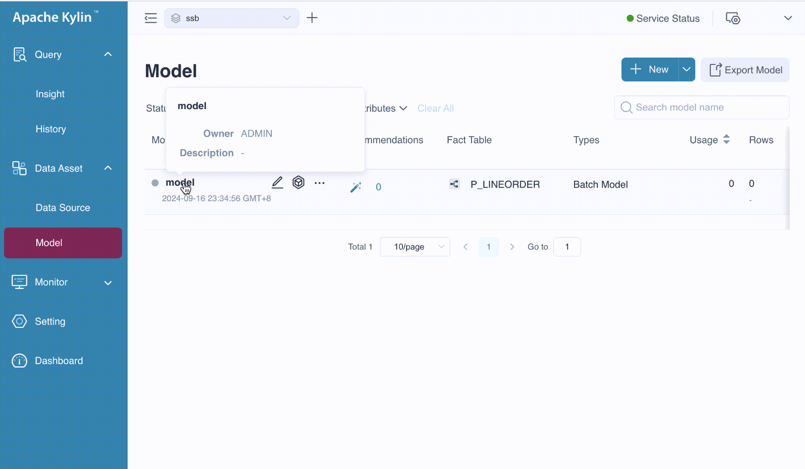
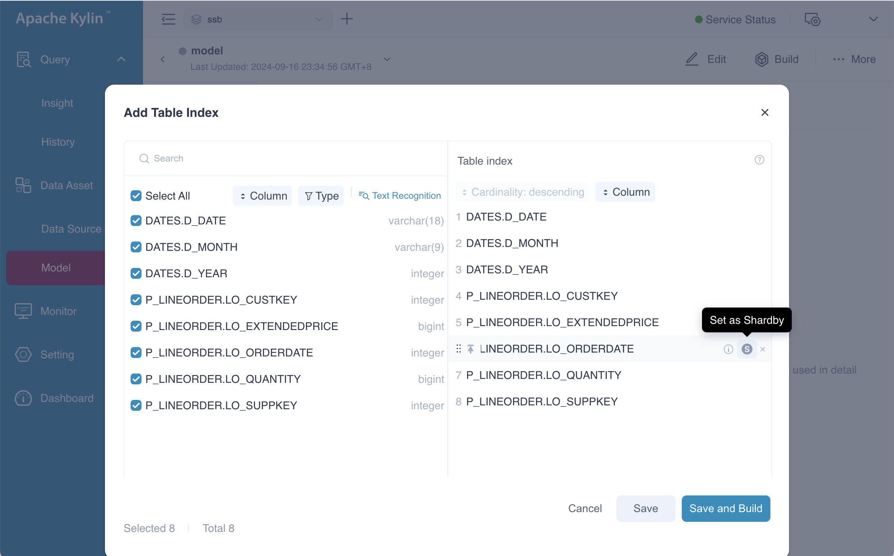
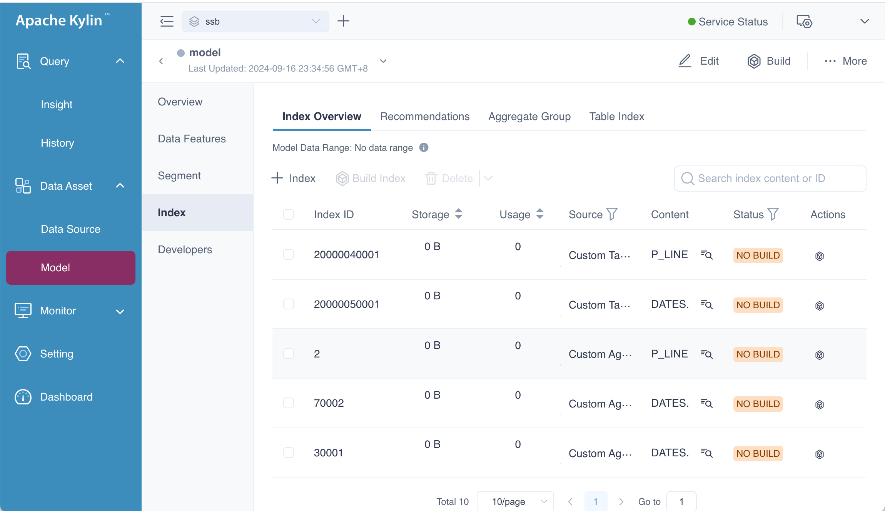

### Overview

In the previous chapter, we discussed how to create an Aggregate Group. Now, we'll focus on its counterpart, the Table Index. A Table Index looks like a table in a data source, but unlike standard tables, it is derived from a flat-table resulting from a join operation. The columns used in a Table Index are from dimensions and measures already defined in the model.

- **Advantages**: Eliminates the overhead of joining tables at query time, resulting in faster query performance.

- **Disadvantages**: When the join relationship is one-to-many, the amount of data can increase significantly. To solve this issue, please refer to the [runtime join](../features/runtime_join.md) chapter for more details.

Now, let's introduce how to create a Table Index. The following GIF demonstrates how to navigate to the **Table Index** page.

### Create Table Index

Click the  button on the Table Index page to open a new window titled **Add Table Index**. This window allows you to create a table index by selecting the columns to include or searching the columns quickly. The available name of columns, along with their types, are displayed on this page. 

After selecting the columns, you can set the shardBy columns and adjust the column order. Choosing an appropriate ShardBy column can distribute raw data into multiple shards, which helps increase concurrency and improve query performance. It's recommended to select columns with relatively large cardinality as the shardBy column to avoid uneven data distribution. Similar to aggregate groups, only one shardBy column will be utilized during queries, and this is optional for the table index too.

You should also arrange the columns in the order of their frequency as filter conditions, as this arrangement can significantly impact query performance.

Currently, you can only add one table index at a time. If you wish to add another, click the  button on the Table Index page and repeat the steps above. Please note that having more table indexes will increase job building and storage costs.

### Table Index View

After creating the table index, you can return to the **Table Index** page to view the indexes you just added. In this example, we successfully added two as follows. 

+ \[*LO_ORDERDATE*, *LO_SUPPKEY*, *LO_QUANTITY*, *LO_EXTENDEDPRICE*\], *LO_ORDERDATE* as shardBy column
+ \[*D_DATE*, *LO_ORDERDATE*, *LO_CUSTKEY*, *D_MONTH*, *D_YEAR*, *LO_EXTENDEDPRICE*\]

### Index Overview

If you want to know the indexes generated by the aggregate group, you should navigate to the **Index Overview** page. This page gives you all the information of index, we will introduce them in the chapter of [model info](http://localhost:3000/latest/docs/model/manage/model_info).

### Summary

In this chapter, we covered how to create table index. However, designing effective indexes seems quite complex, especially for beginners. If you're looking for a simpler approach, please refer to the [recommendation](../rec/intro.md) for more details.
