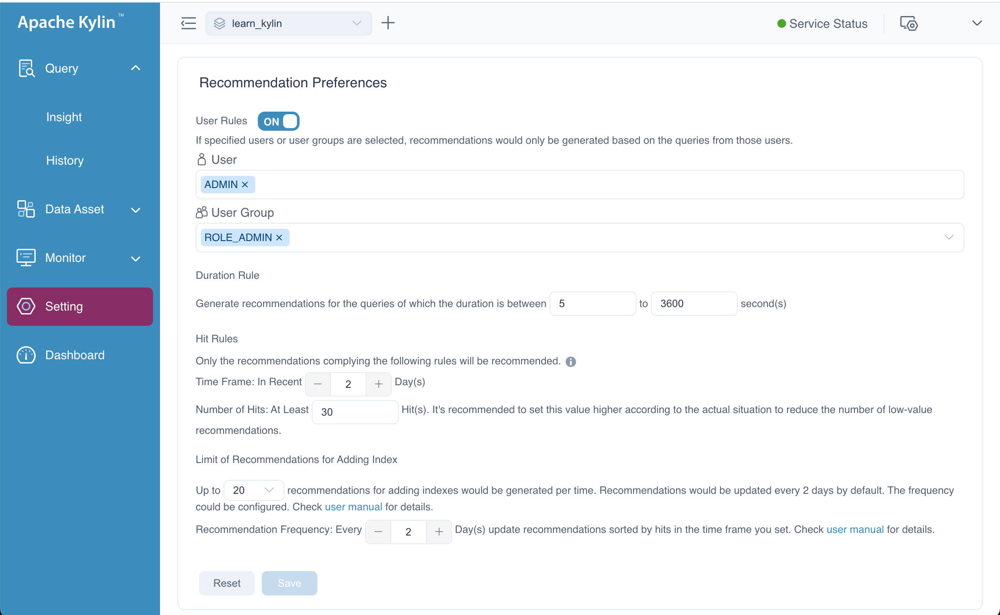
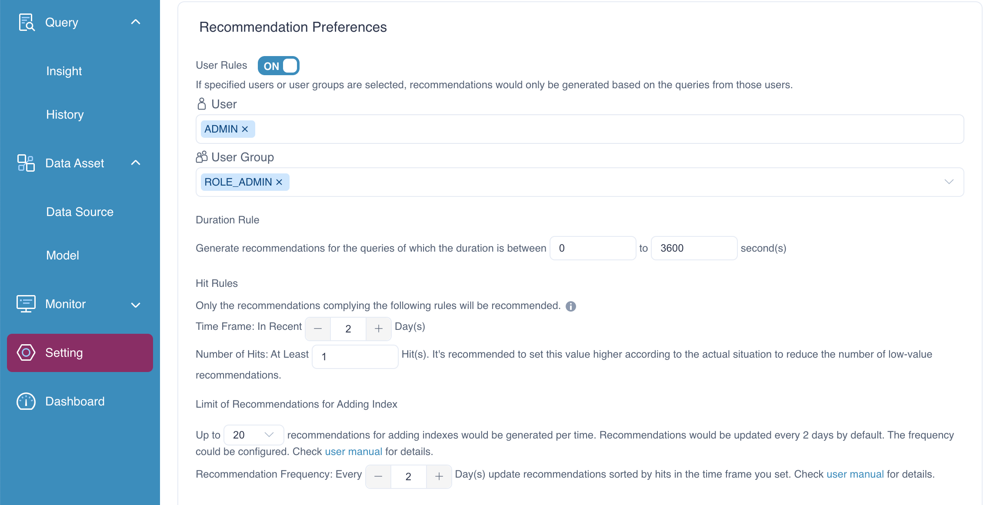
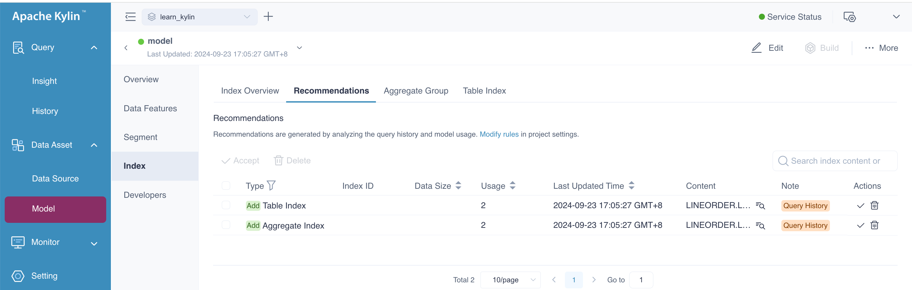

In the previous chapter, we introduced [imported SQL modeling](sql_modeling.md). Here, we will explore another feature—*
*optimizing indexes using query history** in the Kylin Engine. This capability allows the system to recognize and
propose the most valuable indexes based on past queries, helping to accelerate query performance. It simplifies the
process of selecting indexes.

This chapter will cover the following:

1. **Settings to Enable Query History Optimization**: How to configure the system to recognize valuable indexes from
   query history.
2. **Generating Recommendations**: The process for generating index recommendations based on historical query data.
3. **Approving Recommendations**: How to review and approve these recommendations to create the appropriate indexes for
   optimized performance.

### Peferences

After enable the recommendation engine, the **Recommendation Preferences** panel will appear, the page as follows. You
can set user rules, duration rules, hit rules, and limit of Recommendations for Adding Index.

+ **User Rules:** Turn on the toggle switch if you only want to generate recommendations for selected users and/or user
  groups. Then you can select users and/or user groups in the following field(s).

+ **Duration Rule:** Generate recommendations for queries within certain duration. Then you can customize the query
  duration. Default: 5 to 3600 second(s).


- **Hit Rules**: Set the parameters below to filter out indexes that are frequently hit by queries, that is, the indexes
  of high value.
  For example, if the **Time Window** is set to 2 and **Number of Hits** is set to 30, the system will only prompt
  recommendations with at least 30 query hits in the past 2 days.
    - **Time Window**: Set the number of days to be calculated for the query hits, starting from today, default: 2 days.
    - **Number of Hits**: Set the number of query hits (default: 30 hits). This hit count can later be modified based on
      the recommendations.

- **Limit of Recommendations for Adding Index**: Set how many recommendations will be prompted and the push frequency.
  This parameter is only valid for recommendations based on query history.
    - **Number of recommendations**: Set the number of recommendations that will be pushed. Recommendations will be
      ranked based on the query hit rates (from highest to lowest); the default value is 20, indicating only the top 20
      recommendations will be prompted.
    - **Recommendation Frequency**: Set the frequency (in days) to push the recommendations, default: 2 days.



### Generate

The generation of index suggestions is handled as a background task. This task runs at regular intervals, generating
recommendations and storing them in the recommendation table of the database. At this stage, all suggestions remain
invisible. When multiple query histories result in the same recommendation, the system accumulates the recommendation's
statistical frequency on a daily basis.

To configure the task's running frequency, you can refer to the following configuration items. These settings allow you
to control how often the system scans query history and updates recommendations based on usage patterns.

```shell
# This parameter is used for controlling the maximum queries 
# processed by each scheduled task.
# Since the query history table may contain too many records, 
# each task will process at most 1000000 queries by default.
# The engine does not handle all query history items in a single 
# batch due to memory constraints. 
# Instead, it processes them in smaller batches. By default, 
# each batch handles 1,000 queries. 
# The task interval is 60 minutes by default.

kylin.favorite.query-history-accelerate-max-size=1000000
kylin.favorite.query-history-accelerate-batch-size=1000
kylin.favorite.query-history-accelerate-interval=60m
```

In addition, there is a scheduled task in the system that calculates how often a recommended index is "hit" during a
specific **Time Window**. When the **Number of Hits** exceeds the configured threshold, the system exposes the
recommendation to the user, who can then choose whether to accept it. The frequency at which the system generates these
suggestions is controlled by the **Recommendation Frequency** configuration.

:::tip Tips
Ensure that you have sufficient memory available before modifying the configurations mentioned above.
Complex queries typically demand more memory, so if needed, you can adjust the memory limit by modifying
the `conf/setenv.sh` file.

- export JAVA_VM_TOOL_XMS=1g
- export JAVA_VM_TOOL_XMX=8g
  :::

To quickly verify the ability of the system to generate index recommendations, follow these steps:

1. **Execute the Query**: Go to the **Insight** page and run many query statements.

2. **Adjust Configuration Parameters**: Modify the recommended configuration settings to match the values shown in the
   figure.




By running the query and adjusting the parameters, the executing the following API request to trigger the generation of recommendations. After executing the request successfully, you should be able to see recommendations generated based on query history.
```shell
curl -X PUT 'http://localhost:7070/kylin/api/recommendations/acceleration?project=learn_kylin' \
    -H 'Accept-Encoding: gzip, deflate, br' \
    -H 'Accept: application/vnd.apache.kylin-v4+json' \
    -H 'Content-Type: application/json;charset=UTF-8' \
    -H 'Accept-Language: en'
```



### Approve

On the **Recommendation** page, you have the option to review and manage the suggested indexes. You can take the following actions:

- **Accept**: If you choose to accept the recommendation, it will be converted into an index. The index will be applied to the model to improve query performance.

- **Delete**: If you choose to delete the recommendation, it will not be physically removed from the system but will be marked as deleted (logical deletion) and remain in the recommendation table for record-keeping purposes.


### **FAQ**

- Question: At which level will the **Recommendations Preferences** be effective?

  Answer: At the project level. To exclude certain tables at the model level, that is, this table will not be calculated
  during the pre-computation and indexing, please deselect the **Precompute Join Relationships** checkbox in the **Add
  Join Relationship** dialog box. 
