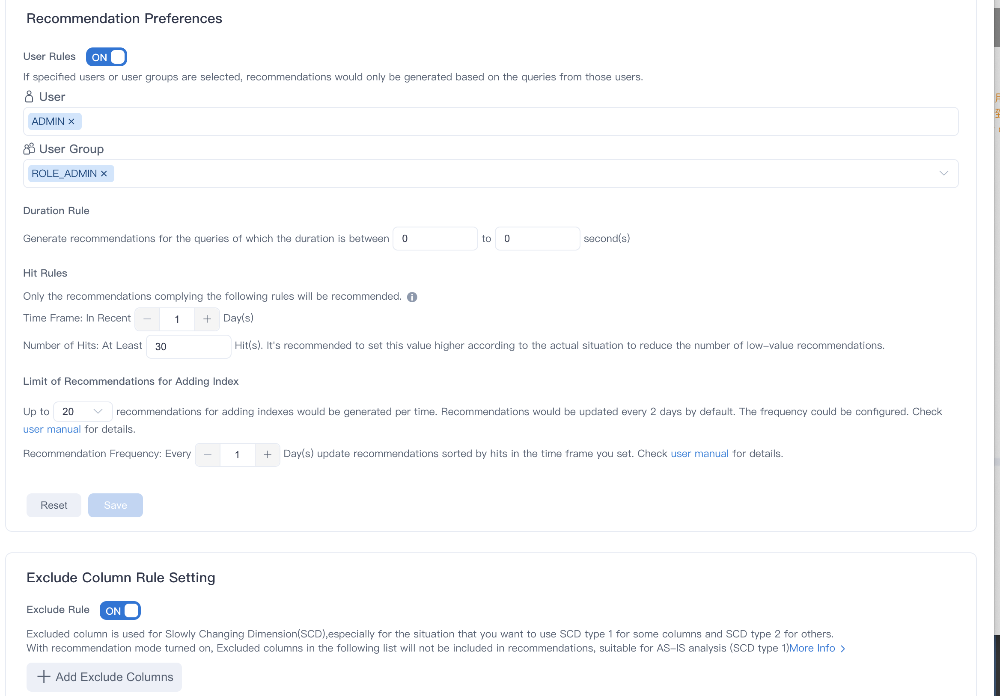

Kylin optimizes query performance with index or model recommendations based on query history, data characteristics, SQL modeling, etc. The [Recommendation](intro.md) feature can simplify model building and accelerate queries. This article covers how to configure the setting for the recommendations. 

### **Prerequisites**

Please make sure that the **Recommendation** feature is turned on.  

:::info

 To turn on the feature, go to the **Home** page of Kylin and click **Turn on Recommendation**. 
:::

### **Background information**

With the "Recommendation" feature enabled, recommendations will be automatically generated and temporarily recorded in the internal system. After you set up the generation rules, the system will only prompt the recommendations that meet the criteria. You can check the recommendations on the **Home** page. 

For more information about recommendation, see [Basic Concepts and Principles](basic_concept_actions.md). 

### **Operation steps**

1. Log in to Kylin. 

   - System admin
   - **Management** or **Admin** of the target project 

2. In the left navigation panel, click **Setting**.

3. On the **Basic Settings** tab, go to the **Recommendation Preferences** section.

4. Specify the following parameters for the rule. Then click **Save** to finish the rule setting. 

   

   - 

5. On the **Basic Settings** tab, go to the **Exclude Column Rule Setting** section to specify exclude columns.

   If turn on this switch, columns can be added after searching the specified table through keywords, and the system will not generate optimization suggestions for exclude columns.

   * Exclude columns is not suitable for fact table. In fact, if a table having exclude columns is chosen as fact table in a model, the excluding rules actually will do nothing for these columns.
   * Exclude columns are used to handle slowly changing dimensions, especially when you want to use SCD type 1 for some columns and SCD type 2 for others. 
   * If you enable intelligent recommendation, the exclude columns will not be recommended to the optimization suggestions. This function applies to the scenario of AS-IS (SCD type 1) analysis.
   * After the Settings take effect, the foreign keys in the fact table are recommended for optimization recommendations instead of the exclude columns, and the columns in the query table can be derived answer from the foreign keys after the index is built.
   * If exclude columns are already used in the indexes, you need to manually delete these indexes dependent on these columns to implement AS-IS (SCD type 1).
   * If you want to implement AS-WAS (SCD type 2) on other columns of lookup table, these columns can be added into index

:::info

 * By default，the 'Exclude Table' function is replaced by 'Exclude Column'，you can set `kylin.metadata.table-exclusion-enabled=true` to enable it in project settings.
 * You can exclude all columns on a table to get the effect of exclude table.
 * The former parameter of exclude table: `kylin.engine.build-excluded-table=true` is now abandon.
:::

- 

