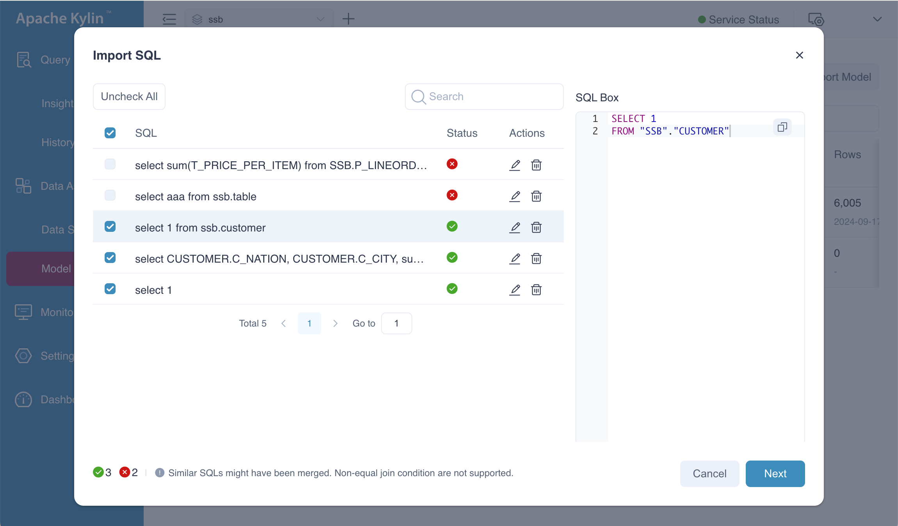
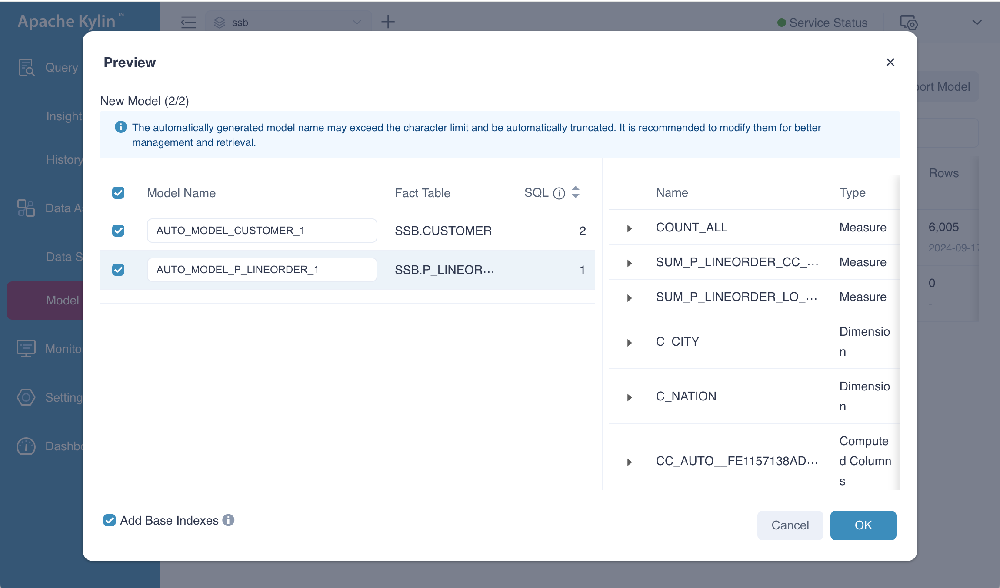
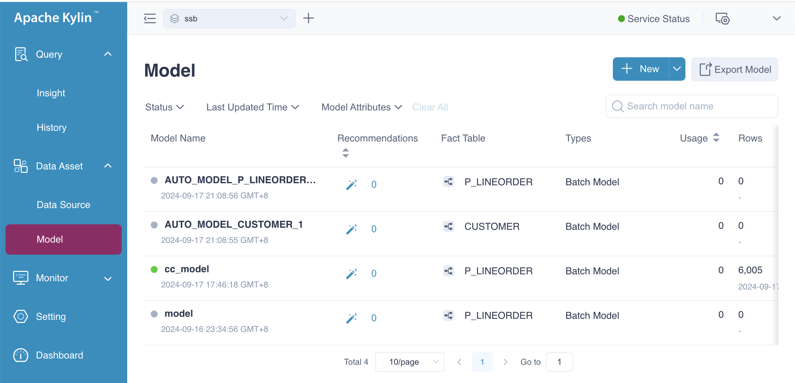
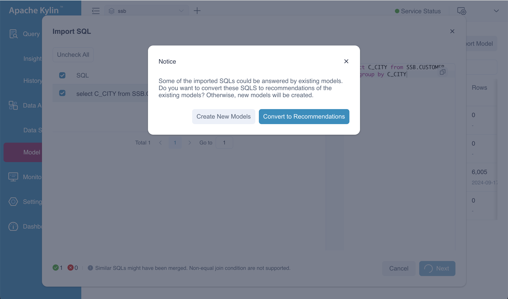
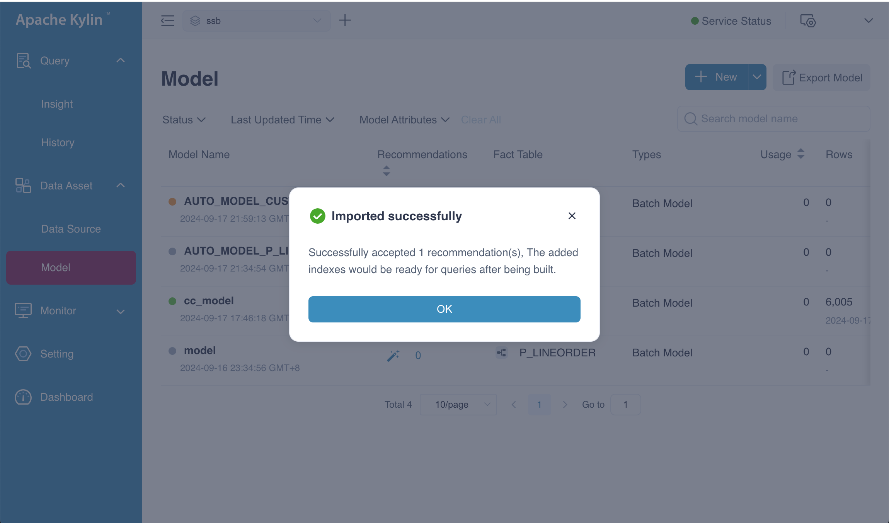
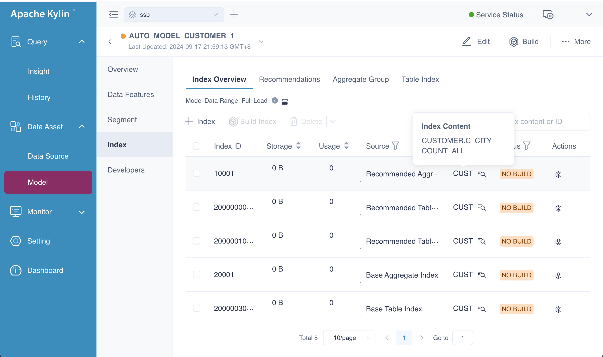
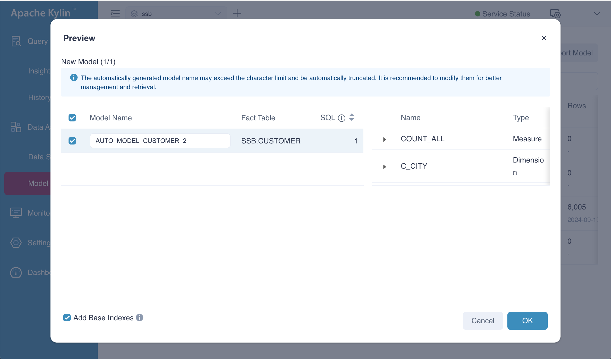

This chapter we will show you how to create model and index by SQL.

### **Prerequisites**

- [Load data source](../../datasource/intro.md). This article takes this [SSB sample dataset](../../quickstart/tutorial.md) as an example to build model and indexes. 

- Save the SQL statements as a *.txt* or *.sql* file. The following SQL statement is used in this article. 

  
  
    :::tip Tips
    The file size should be no larger than 5 MB. If there are multiple SQL statements, separate them by semicolons (;). 
    :::
- Create a project if you have not created any projects yet. For more details, refer to [Create project](../../operations/project-managing/project_management.md).
- Turn on recommendation function in the project setting page, this has been introduced in the chapter [Recommendation](intro.md).

### Create Model

The following figure shows the entrance to SQL modeling. Please select **From SQL**, and the system will prompt you to upload the file. After the upload is completed, please click Next.


In this example, we use the SQL statements as following.

```sql
-- valid sql
select 1 from SSB.CUSTOMER;
select C_CUSTKEY from SSB.CUSTOMER;

-- invalid sql, T_PRICE_PER_ITEM looks like a computed column name
select sum(T_PRICE_PER_ITEM) from SSB.P_LINEORDER;

-- valid sql
select 
    CUSTOMER.C_NATION, 
    CUSTOMER.C_CITY,
    sum(P_LINEORDER.LO_SUPPLYCOST + 1), 
    sum(P_LINEORDER.LO_REVENUE)
from 
    SSB.P_LINEORDER
left join SSB.CUSTOMER on P_LINEORDER.LO_CUSTKEY = CUSTOMER.C_CUSTKEY
left join SSB.PART  on P_LINEORDER.LO_PARTKEY = PART.P_PARTKEY
group by 
    CUSTOMER.C_NATION, 
    CUSTOMER.C_CITY;

-- valid sql, but useless, will be ignored by the engine
select 1;

-- invalid sql, bail out
select AAA from CCB.TABLE1;
```


After the SQL has been analyzed, you will see a screen similar to the one shown below. In this example, there are two invalid SQL statements. You can safely ignore these and proceed to the next step.




The **Preview** dialog box displays the model created from the SQL input. You will see two proposed models, along with their respective computed columns, dimensions, and measures. Although the indexes for the models are also generated, they are not displayed here, as the focus is primarily on the model itself. 


   - **Model Name**: It is automatically generated and takes the format `AUTO_MODEL_FACT TABLE NAME_NUMBER`. You can also manually adjust the model name. It can be any combination of numbers, letters, and underscores (`_`).  The maximum length of the model name is 127 characters. When the fact table name is too long, the system will automatically truncate the fact table name from the end to ensure that the automatically generated model name is less than or equal to 127 characters. When truncated, the model name format is `AUTO_MODEL_TRUNCATED FACT TABLE NAME_NUMBER`.
   - **Fact Table**: The fact table of model.
   - **SQL**: The sql related to the model.  Similar SQL statements will be merged when generating models.
   - **Add Base Indexes**: Basic indexes include base aggregated indexes and base table indexes. Base aggregated indexes contain all model dimensions and measures, and base table indexes contain columns used in all model dimensions and measures.  It's recommended to keep it selected to avoid frequent [query push-down](../../query/push_down.md) which may increase query response times. By default, base indexes will automatically update with model changes. 


If you click the **OK** button, these two models will be added to the system. Then you can go to model list page, you will see a page as follows.




### Convert to Index

In this section, we'll demonstrate another case of creating indexes using SQL. Before proceeding, we need to bring the model *AUTO_MODEL_CUSTOMER_1* online. Once the model is online, we can import the following SQL statement, which will result in the following outcome.

```sq
select C_CITY from SSB.CUSTOMER group by C_CITY;
```

You have two options:

+ **Create New Models**: This option will add a new model to the system based on the SQL input.

+ **Convert to Recommendations**: This option will provide recommendations on the existing model and propose new indexes based on the query patterns.





After selecting **Convert to Recommendations** and accepting the proposed result on the **Preview** page, you should see a confirmation indicating success. This means the recommended indexes have been successfully generated. 

To verify this, navigate to the **Index Overview** page, where you will be able to view the newly created indexes. This step allows you to confirm that the system has applied the optimizations and recommendations to improve query performance based on your model's structure.





As shown in the picture, there is a **Recommended Aggregate Index** whose content is *\[C_CICTY, COUNT_ALL\]* corresponding to our input sql statement. Besides, the base indexes has been updated, you can check on your system.





### Create New Model

When you select **Create New Models**, the system will generate a new model, such as *AUTO_MODEL_CUSTOMER_2*, with *SSB.CUSTOMER* as the fact table. However, we against doing this, as it may lead to the creation of numerous similar models. Managing a large number of models can become difficult and inefficient.




