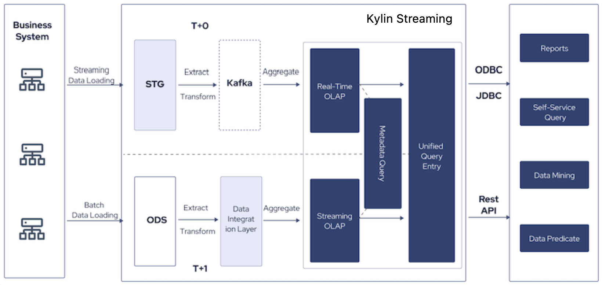

Real-Time is an advanced feature that supports querying real-time streaming data, which achieves lower latency from data loading to query. 

### Background

Nowadays more and more users begin to apply real-time analytics in different use cases for better user experience, service quality and informed decision-making. This can be achieved by introducing a streaming real-time data platform. However, the addition of a platform may bring problems like data inconsistency, high costs, and managing difficulties.

Kylin empowers users with a single platform to handle both offline and real-time data. This low-threshold platform makes it easy for companies to unify data semantics, unlock data insights, and accelerate business decision-making in response to market changes. 

### Features

- **Low latency and high concurrency**

  Kylin Real-Time meets the requirements of low latency and high concurrency for OLAP analysis. 

- **From T+1 to T+0**

  Kylin Real-Time shortens the query processing cycle from T+1 to T+0. Users can achieve sub-second query response against data with minute-level latency, bringing down development and managing costs for real-time analytics scenarios. 

- **High performance and low TCO**

  Kylin Real-Time empowers users with an OLAP solution for real-time analytics scenarios with better performance at a lower cost.

### See also

- [Hardware and software requirements](prerequisite.md)
- [Work with Kylin Real-time](real-time.md)