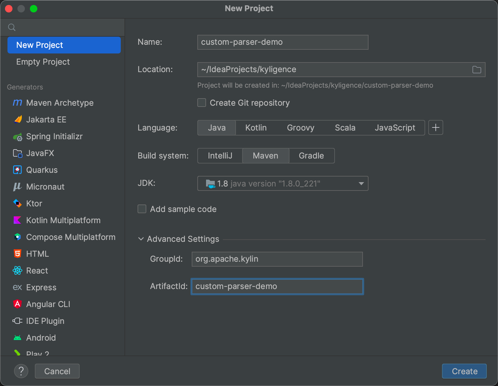
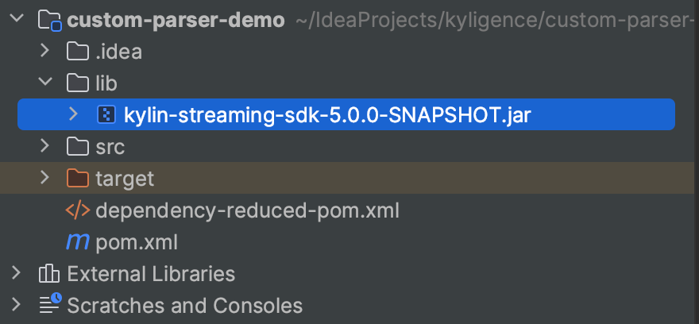
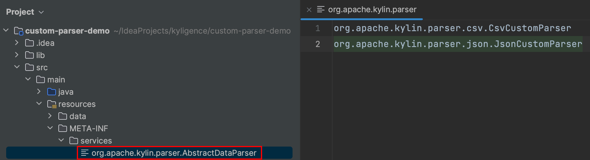
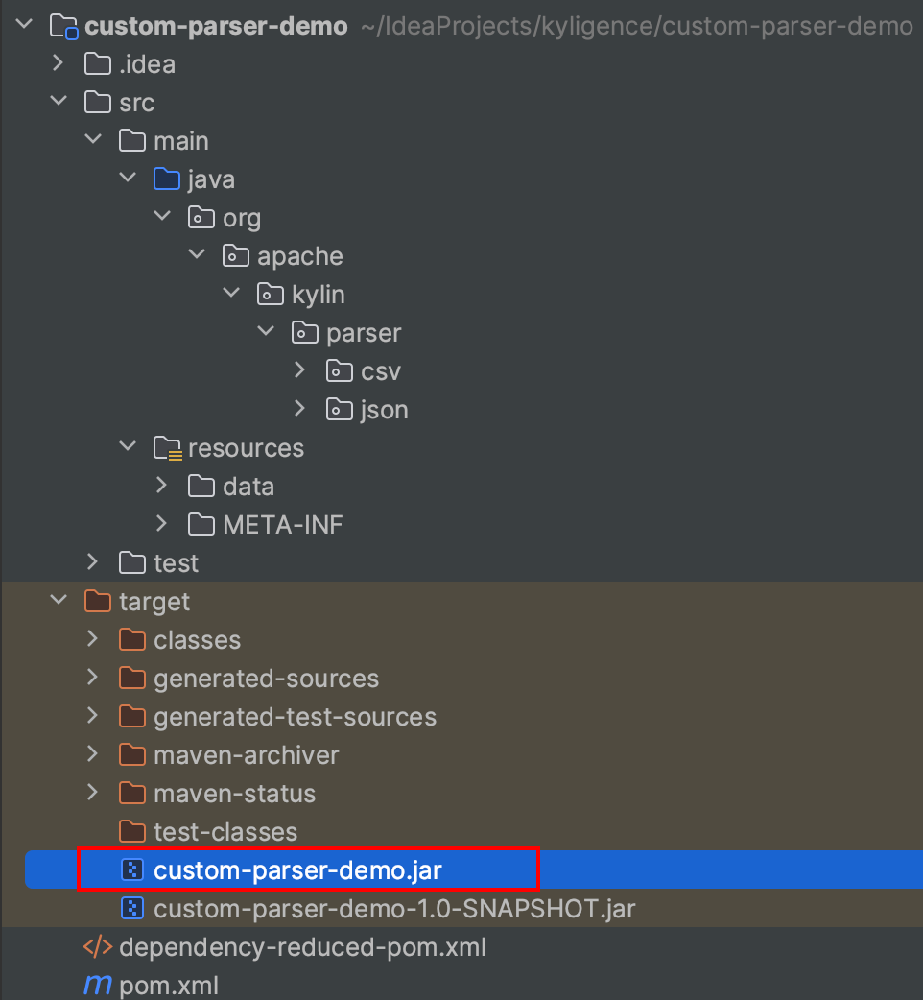
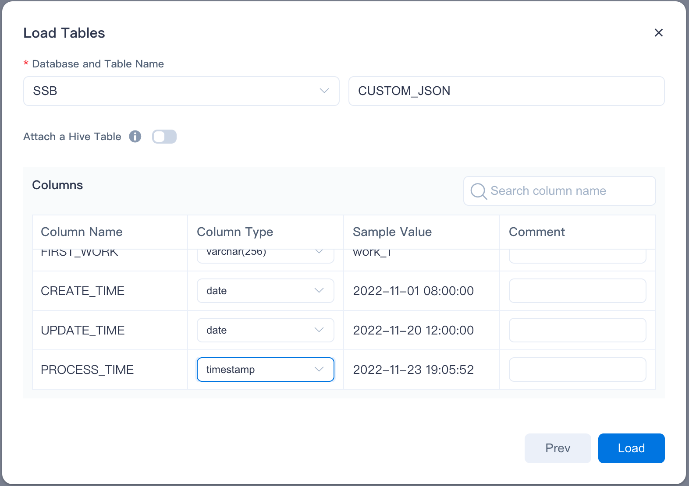
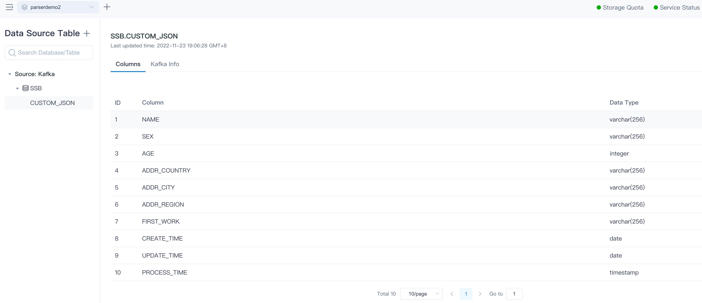
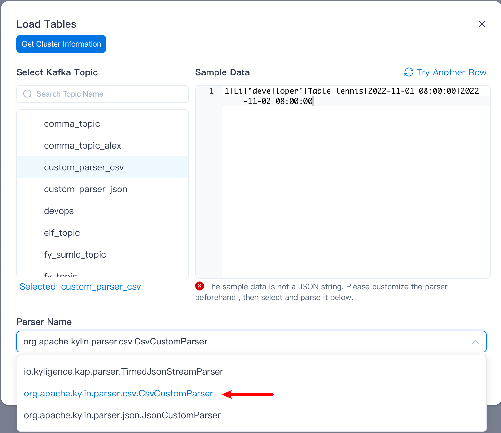
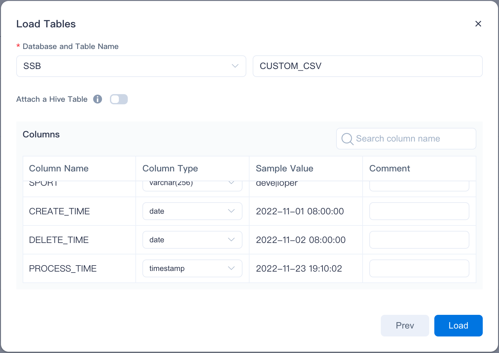
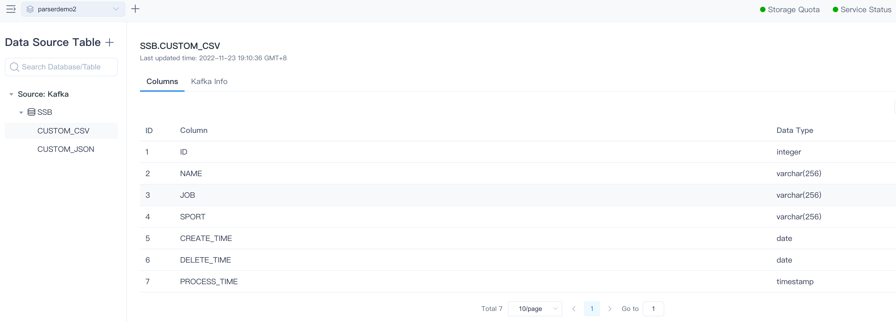

Kylin supports custom parsing of Kafka data through the SDK.

## Setting up the development environment

### Create a Project

- Use Maven to manage project dependencies




### Modify the pom.xml file

```xml
<build>
    <plugins>
        <plugin>
            <groupId>org.apache.maven.plugins</groupId>
            <artifactId>maven-compiler-plugin</artifactId>
            <version>3.10.1</version>
            <configuration>
                <source>1.8</source>
                <target>1.8</target>
            </configuration>
        </plugin>

        <plugin>
            <groupId>org.apache.maven.plugins</groupId>
            <artifactId>maven-shade-plugin</artifactId>
            <version>3.3.0</version>
            <executions>
                <execution>
                    <phase>package</phase>
                    <goals>
                        <goal>shade</goal>
                    </goals>
                    <configuration>
                        <finalName>${artifactId}</finalName>
                        <artifactSet>
                            <excludes>
                                <exclude>org.apache.kylin:kylin-streaming-sdk</exclude>
                                <exclude>org.projectlombok:*</exclude>
                                <exclude>org.apache.commons:*</exclude>
                                <exclude>com.fasterxml.jackson.core:*</exclude>
                                <exclude>com.google.guava:*</exclude>
                                <exclude>org.slf4j:*</exclude>
                            </excludes>
                        </artifactSet>
                        <filters>
                            <filter>
                                <artifact>*:*</artifact>
                                <excludes>
                                    <exclude>META-INF/*.SF</exclude>
                                    <exclude>META-INF/*.DSA</exclude>
                                    <exclude>META-INF/*.RSA</exclude>
                                    <exclude>javax/annotation/**</exclude>
                                </excludes>
                            </filter>
                        </filters>
                    </configuration>
                </execution>
            </executions>
        </plugin>
    </plugins>
</build>
```


### Import SDK

Copy `${KYLIN_HOME}/server/jars/kylin-streaming-sdk-{version}.jar`.

Create a new `lib` directory in the project root directory. And put the SDK Jar into the `lib` directory.



Load the SDK dependencies into the project

```xml
<properties>
    <maven.compiler.source>8</maven.compiler.source>
    <maven.compiler.target>8</maven.compiler.target>
    <project.build.sourceEncoding>UTF-8</project.build.sourceEncoding>
    <noop.version>1</noop.version>
</properties>

<dependencies>
    <dependency>
        <groupId>org.apache.kylin</groupId>
        <artifactId>kylin-streaming-sdk</artifactId>
        <version>${noop.version}</version>
        <scope>system</scope>
        <systemPath>${project.basedir}/lib/kylin-streaming-sdk-{version}.jar</systemPath>
    </dependency>
    <dependency>
        <groupId>org.apache.logging.log4j</groupId>
        <artifactId>log4j-slf4j-impl</artifactId>
        <version>2.18.0</version>
    </dependency>
    <dependency>
        <groupId>org.apache.commons</groupId>
        <artifactId>commons-lang3</artifactId>
        <version>3.10</version>
    </dependency>
</dependencies>
```

### Implement a custom parser

- Create a new parser class, `XXXParser extends AbstractDataParser<ByteBuffer>`.
- `Override parse(ByteBuffer input)`, Parse a single piece of data within a method, return `Map<Field Name, Field Value>`.
- If there are initialization actions that need to be done while the instance resolver class is in use, do so in a parameterless construct.
- `Override before()` if an initialization action is required before each data is parsed.
- If an exception is thrown during the parsing of a single piece of data, the data will be considered dirty during the build and the construction of this piece of data will be skipped.
- To check data after each piece of data is processed, `Override after()`.
- Create `${project.basedir}/src/resources/META-INF/services/org.apache.kylin.parser.AbstractDataParser` file, and each of the parser class's class path to fill them.




### Demo Parser

**pom.xml**

```xml
<?xml version="1.0" encoding="UTF-8"?>
<project xmlns="http://maven.apache.org/POM/4.0.0"
         xmlns:xsi="http://www.w3.org/2001/XMLSchema-instance"
         xsi:schemaLocation="http://maven.apache.org/POM/4.0.0 http://maven.apache.org/xsd/maven-4.0.0.xsd">
    <modelVersion>4.0.0</modelVersion>

    <groupId>org.apache.kylin</groupId>
    <artifactId>custom-parser-demo</artifactId>
    <version>1.0-SNAPSHOT</version>

    <properties>
        <maven.compiler.source>8</maven.compiler.source>
        <maven.compiler.target>8</maven.compiler.target>
        <project.build.sourceEncoding>UTF-8</project.build.sourceEncoding>
        <noop.version>1</noop.version>
    </properties>

    <dependencies>
        <!-- SDK -->
        <dependency>
            <groupId>org.apache.kylin</groupId>
            <artifactId>kylin-streaming-sdk</artifactId>
            <version>${noop.version}</version>
            <scope>system</scope>
            <systemPath>${project.basedir}/lib/kylin-streaming-sdk-5.0.0-SNAPSHOT.jar</systemPath>
        </dependency>

        <!-- Json -->
        <dependency>
            <groupId>com.fasterxml.jackson.core</groupId>
            <artifactId>jackson-databind</artifactId>
            <version>2.14.0</version>
        </dependency>
        <!-- CSV -->
        <dependency>
            <groupId>com.opencsv</groupId>
            <artifactId>opencsv</artifactId>
            <version>5.7.1</version>
            <exclusions>
                <exclusion>
                    <groupId>commons-collections</groupId>
                    <artifactId>commons-collections</artifactId>
                </exclusion>
            </exclusions>
        </dependency>

        <!-- Others -->
        <dependency>
            <groupId>org.projectlombok</groupId>
            <artifactId>lombok</artifactId>
            <version>1.18.24</version>
            <scope>compile</scope>
        </dependency>
        <dependency>
            <groupId>com.google.guava</groupId>
            <artifactId>guava</artifactId>
            <version>31.1-jre</version>
        </dependency>
        <dependency>
            <groupId>org.apache.logging.log4j</groupId>
            <artifactId>log4j-slf4j-impl</artifactId>
            <version>2.18.0</version>
        </dependency>
        <dependency>
            <groupId>org.apache.commons</groupId>
            <artifactId>commons-lang3</artifactId>
            <version>3.10</version>
        </dependency>
    </dependencies>

    <build>
        <plugins>
            <plugin>
                <groupId>org.apache.maven.plugins</groupId>
                <artifactId>maven-compiler-plugin</artifactId>
                <version>3.10.1</version>
                <configuration>
                    <source>1.8</source>
                    <target>1.8</target>
                    <encoding>UTF-8</encoding>
                </configuration>
            </plugin>

            <plugin>
                <groupId>org.apache.maven.plugins</groupId>
                <artifactId>maven-shade-plugin</artifactId>
                <version>3.3.0</version>
                <executions>
                    <execution>
                        <phase>package</phase>
                        <goals>
                            <goal>shade</goal>
                        </goals>
                        <configuration>
                            <finalName>${artifactId}</finalName>
                            <artifactSet>
                                <excludes>
                                    <exclude>org.apache.kylin:kylin-streaming-sdk</exclude>
                                    <exclude>org.projectlombok:*</exclude>
                                    <exclude>org.apache.commons:*</exclude>
                                    <exclude>com.fasterxml.jackson.core:*</exclude>
                                    <exclude>com.google.guava:*</exclude>
                                    <exclude>org.slf4j:*</exclude>
                                    <exclude>org.apache.logging.log4j:*</exclude>
                                </excludes>
                            </artifactSet>
                            <filters>
                                <filter>
                                    <artifact>*:*</artifact>
                                    <excludes>
                                        <exclude>META-INF/*.SF</exclude>
                                        <exclude>META-INF/*.DSA</exclude>
                                        <exclude>META-INF/*.RSA</exclude>
                                        <exclude>javax/annotation/**</exclude>
                                    </excludes>
                                </filter>
                            </filters>
                        </configuration>
                    </execution>
                </executions>
            </plugin>
        </plugins>
    </build>
</project>
```

#### Parse JSON

**Input sample data**
```json
{
  "name": "Li",
  "sex": "man",
  "age": 24,
  "addr": {
    "country": "China",
    "city": "Shanghai",
    "region": "YangPu"
  },
  "works": [
    "work_1",
    "work_2",
    "work_3"
  ],
  "create_time": "2022-11-01 08:00:00",
  "update_time": "2022-11-20 12:00:00"
}
```

**Output parsed data**
```json
{
  "name": "Li",
  "sex": "man",
  "age": 24,
  "addr_country": "China",
  "addr_city": "Shanghai",
  "addr_region": "YangPu",
  "first_works": "work_1",
  "create_time": "2022-11-01 08:00:00",
  "update_time": "2022-11-20 12:00:00",
  "process_time": "2022-11-20 13:00:00"
}
```

**The parser code**
```java
package org.apache.kylin.parser.json;

import com.fasterxml.jackson.annotation.JsonProperty;
import com.fasterxml.jackson.databind.ObjectMapper;
import com.google.common.collect.Lists;
import lombok.Data;
import lombok.Getter;
import lombok.SneakyThrows;
import org.apache.commons.lang3.time.DateFormatUtils;
import org.apache.kylin.parser.AbstractDataParser;
import org.apache.kylin.parser.utils.ParserBenchMark;

import java.nio.ByteBuffer;
import java.nio.charset.StandardCharsets;
import java.util.List;
import java.util.Map;

public class JsonCustomParser extends AbstractDataParser<ByteBuffer> {

    private static final String JSON_INPUT_STR = "{\"name\": \"Li\",\"sex\": \"man\",\"age\": 24,\"addr\": {\"country\": \"China\",\"city\": \"Shanghai\",\"region\": \"YangPu\"},\"works\": [\"work_1\",\"work_2\",\"work_3\"],\"create_time\": \"2022-11-01 08:00:00\",\"update_time\": \"2022-11-20 12:00:00\"}";
    private static final ObjectMapper MAPPER = new ObjectMapper();

    @SneakyThrows
    @Override
    protected Map<String, Object> parse(ByteBuffer buffer) {
        JsonInputEntry inputEntry = MAPPER.readValue(buffer.array(), JsonInputEntry.class);
        JsonOutputEntry outputEntry = JsonOutputEntry.transform(inputEntry);
        return MAPPER.convertValue(outputEntry, Map.class);
    }

    @SneakyThrows
    public static void main(String[] args) {
        // get parser
        AbstractDataParser<ByteBuffer> dataParser = AbstractDataParser.getDataParser(JsonCustomParser.class.getName(),
                Thread.currentThread().getContextClassLoader());
        // parse
        ByteBuffer byteBuffer = StandardCharsets.UTF_8.encode(JSON_INPUT_STR);
        Map<String, Object> resultMap = dataParser.process(byteBuffer);
        System.out.println(MAPPER.writerWithDefaultPrettyPrinter().writeValueAsString(resultMap));
        // parser BenchMark
        System.out.printf("parser 20k data, cost: %s ms \n", ParserBenchMark.test20K(byteBuffer, dataParser));
        System.out.printf("parser 40k data, cost: %s ms \n", ParserBenchMark.test40K(byteBuffer, dataParser));
        System.out.printf("parser 60k data, cost: %s ms \n", ParserBenchMark.test60K(byteBuffer, dataParser));
        System.out.printf("parser 999999 data, cost: %s ms \n", ParserBenchMark.testWithSize(byteBuffer, dataParser, 999999));
    }

    @Data
    public static class JsonInputEntry {
        private String name;
        private String sex;
        private int age;
        private Addr addr;
        @Getter
        private final List<String> works = Lists.newArrayList();
        @JsonProperty("create_time")
        private String createTime;
        @JsonProperty("update_time")
        private String updateTime;
    }

    @Data
    public static class Addr {
        private String country;
        private String city;
        private String region;
    }

    @Data
    public static class JsonOutputEntry {
        private String name;
        private String sex;
        private int age;
        @JsonProperty("addr_country")
        private String addrCountry;
        @JsonProperty("addr_city")
        private String addrCity;
        @JsonProperty("addr_region")
        private String addrRegion;
        @JsonProperty("first_work")
        private String firstWork;
        @JsonProperty("create_time")
        private String createTime;
        @JsonProperty("update_time")
        private String updateTime;
        @JsonProperty("process_time")
        private String processTime;

        public static JsonOutputEntry transform(JsonInputEntry inputEntry) {
            JsonOutputEntry outputEntry = new JsonOutputEntry();
            outputEntry.setName(inputEntry.getName());
            outputEntry.setSex(inputEntry.getSex());
            outputEntry.setAge(inputEntry.getAge());
            outputEntry.setAddrCountry(inputEntry.getAddr().getCountry());
            outputEntry.setAddrCity(inputEntry.getAddr().getCity());
            outputEntry.setAddrRegion(inputEntry.getAddr().getRegion());
            outputEntry.setFirstWork(inputEntry.getWorks().isEmpty() ? null : inputEntry.getWorks().get(0));
            outputEntry.setCreateTime(inputEntry.getCreateTime());
            outputEntry.setUpdateTime(inputEntry.getUpdateTime());
            outputEntry.setProcessTime(DateFormatUtils.format(System.currentTimeMillis(), "yyyy-MM-dd HH:mm:ss"));
            return outputEntry;
        }
    }
}
```


#### Parse CSV

This case use '|' as CSV separator

**Input sample data**
```csv
1|Li|"deve|loper"|Table tennis|2022-11-01 08:00:00|2022-11-02 08:00:00
```

**Output parsed data**
```json
{
  "id" : 1,
  "name" : "Li",
  "job" : "Table tennis",
  "sport" : "deve|loper",
  "create_time" : "2022-11-01 08:00:00",
  "delete_time" : "2022-11-02 08:00:00",
  "process_time" : "2022-11-21 16:28:05"
}
```

**The parser code**
```java
package org.apache.kylin.parser.csv;

import com.fasterxml.jackson.annotation.JsonProperty;
import com.fasterxml.jackson.databind.ObjectMapper;
import com.google.common.collect.Lists;
import com.google.common.collect.Maps;
import com.opencsv.CSVParser;
import com.opencsv.CSVParserBuilder;
import com.opencsv.CSVReader;
import com.opencsv.CSVReaderBuilder;
import lombok.Data;
import lombok.SneakyThrows;
import org.apache.commons.lang3.time.DateFormatUtils;
import org.apache.kylin.parser.AbstractDataParser;
import org.apache.kylin.parser.utils.ParserBenchMark;

import java.io.IOException;
import java.io.StringReader;
import java.nio.ByteBuffer;
import java.nio.charset.StandardCharsets;
import java.util.List;
import java.util.Map;

public class CsvCustomParser extends AbstractDataParser<ByteBuffer> {

    private static final String CSV_INPUT_STR = "1|Li|\"deve|loper\"|Table tennis|2022-11-01 08:00:00|2022-11-02 08:00:00";
    private static final ObjectMapper MAPPER = new ObjectMapper();
    private static final CSVParser csvParser = new CSVParserBuilder()
            .withSeparator('|')
            .withQuoteChar('"')
            .withEscapeChar('\\')
            .build();

    @SneakyThrows
    @Override
    protected Map<String, Object> parse(ByteBuffer buffer) {
        try (StringReader reader = new StringReader(StandardCharsets.UTF_8.decode(buffer).toString());
             CSVReader csvReader = new CSVReaderBuilder(reader).withCSVParser(csvParser).build()) {
            List<String> line = Lists.newArrayList(csvReader.readNext());
            if (line.isEmpty()) {
                return Maps.newHashMap();
            }
            CsvOutputEntry outputEntry = CsvOutputEntry.transform(line);
            return MAPPER.convertValue(outputEntry, Map.class);
        } catch (IOException e) {
            throw new RuntimeException(e);
        }
    }

    @SneakyThrows
    public static void main(String[] args) {
        // get parser
        AbstractDataParser<Object> dataParser = AbstractDataParser.getDataParser(CsvCustomParser.class.getName(),
                Thread.currentThread().getContextClassLoader());
        // parse
        ByteBuffer byteBuffer = StandardCharsets.UTF_8.encode(CSV_INPUT_STR);
        Map<String, Object> resultMap = dataParser.process(byteBuffer);
        System.out.println(MAPPER.writerWithDefaultPrettyPrinter().writeValueAsString(resultMap));
        // parser BenchMark
        System.out.printf("parser 20k data, cost: %s ms \n", ParserBenchMark.test20K(byteBuffer, dataParser));
        System.out.printf("parser 40k data, cost: %s ms \n", ParserBenchMark.test40K(byteBuffer, dataParser));
        System.out.printf("parser 60k data, cost: %s ms \n", ParserBenchMark.test60K(byteBuffer, dataParser));
        System.out.printf("parser 999999 data, cost: %s ms \n", ParserBenchMark.testWithSize(byteBuffer, dataParser, 999999));
    }

    @Data
    public static class CsvOutputEntry {
        private long id;
        private String name;
        private String job;
        private String sport;
        @JsonProperty("create_time")
        private String createTime;
        @JsonProperty("delete_time")
        private String deleteTime;
        @JsonProperty("process_time")
        private String processTime;

        public static CsvOutputEntry transform(List<String> line) {
            CsvOutputEntry outputEntry = new CsvOutputEntry();
            outputEntry.setId(Long.parseLong(line.get(0)));
            outputEntry.setName(line.get(1));
            outputEntry.setSport(line.get(2));
            outputEntry.setJob(line.get(3));
            outputEntry.setCreateTime(line.get(4));
            outputEntry.setDeleteTime(line.get(5));
            outputEntry.setProcessTime(DateFormatUtils.format(System.currentTimeMillis(), "yyyy-MM-dd HH:mm:ss"));
            return outputEntry;
        }
    }
}
```


### Project Package

```shell
mvn clean package -DskipTests
```

Generate `${project.basedir}/target/custom-parser-demo.jar`



### Upload a custom parser to the system

For more details, please refer to [Custom Parser Jar Package Management API](../../../restapi/custom_jar_manager_api.md)。

## Create Kafka tables using a custom parser

### Json







### CSV








