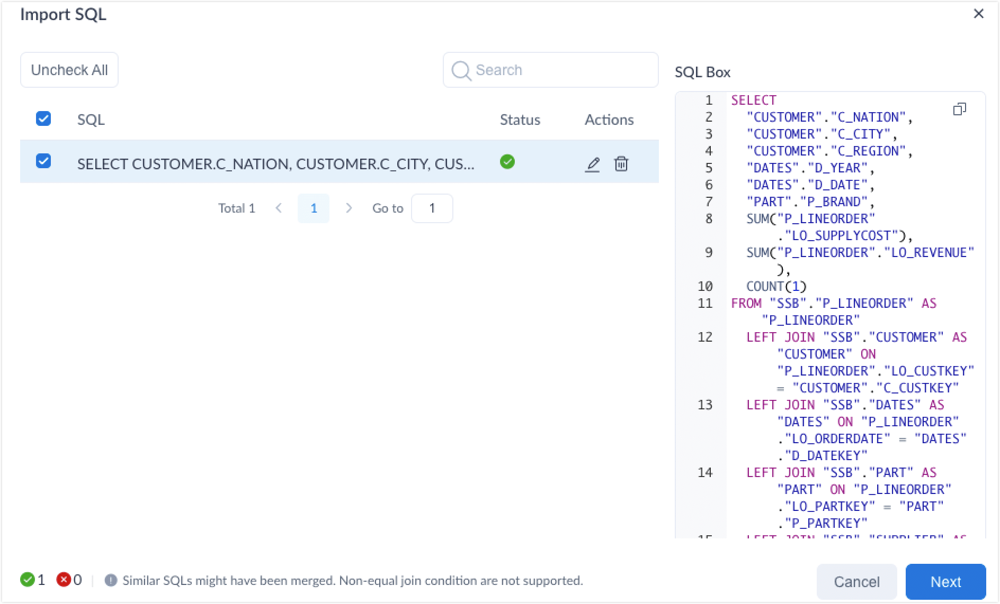
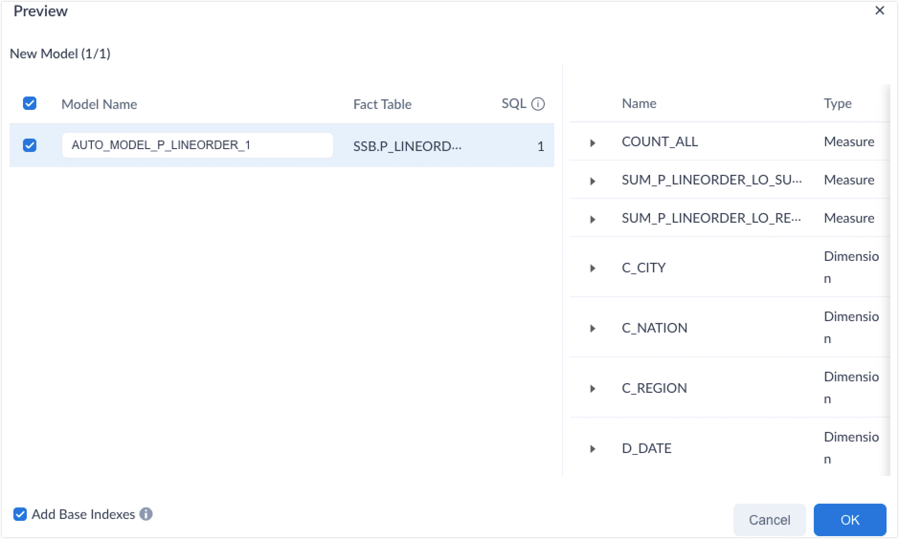

Kylin model consists of tables and their join relations, as well as defined dimensions and measures. After you upload SQL statements, Kylin automatically parses dimensions, measures and other critical information, and guides you through the modeling process. You do not need profound knowledge to design a model that satisfies your needs, which greatly shortens the model development cycle. 

### **Prerequisites**

- [Load data source](../../datasource/intro.md). This article takes this [SSB sample dataset](../../quickstart/tutorial.md) as an example to build model and indexes. 

- Save the SQL statements as a TXT or SQL file. The following SQL statement is used in this article. 

  ```sql
  SELECT 
  CUSTOMER.C_NATION, CUSTOMER.C_CITY, CUSTOMER.C_REGION, DATES.D_YEAR, DATES.D_DATE, PART.P_BRAND
  ,sum(P_LINEORDER.LO_SUPPLYCOST), sum(P_LINEORDER.LO_REVENUE),count(1)
  FROM 
  "SSB"."P_LINEORDER" as "P_LINEORDER" 
  LEFT JOIN "SSB"."CUSTOMER" as "CUSTOMER" ON "P_LINEORDER"."LO_CUSTKEY"="CUSTOMER"."C_CUSTKEY"
  LEFT JOIN "SSB"."DATES" as "DATES" ON "P_LINEORDER"."LO_ORDERDATE"="DATES"."D_DATEKEY"
  LEFT JOIN "SSB"."PART" as "PART" ON "P_LINEORDER"."LO_PARTKEY"="PART"."P_PARTKEY"
  LEFT JOIN "SSB"."SUPPLIER" as "SUPPLIER" ON "P_LINEORDER"."LO_SUPPKEY"="SUPPLIER"."S_SUPPKEY"
  group by CUSTOMER.C_NATION, CUSTOMER.C_CITY, CUSTOMER.C_REGION, DATES.D_YEAR, DATES.D_DATE, PART.P_BRAND;
  ```

  > [!NOTE]
  >
  > The file size should be no larger than 5 MB. If there are multiple SQL statements, separate them by semicolons (;). 


### Operation steps

1. Log in to Kylin as either of the following roles: 
   - System admin 
   - **Admin** of the target project

2. Enable Intelligent Recommendation for the target project. Create a project if you have not created any projects yet. For more information, see [Create project](../../operations/project-managing/project_management.md). 
   1. On the **Home** page, click **Turn on Recommendation**. 

      

   2. Click **Turn on** in the confirmation dialog box.

3. In the left navigation panel, click **Data Assets** > **Data Source**.

4. Select **+ Model** > **From SQL**. 

   

5. In the pop-up dialog box, click **Upload**. Select and upload the SQL file, and then click **Next**.

6. In the **Import SQL** dialog box, check if the SQL queries are correctly parsed. Then click **Next**. 

   

   > [!NOTE]
   >
   > - Kylin merges similar SQL statements. You can select, edit or delete the SQL statements to be loaded. 
   >
   > - Kylin will suggest converting existing models that match certain SQL queries into recommendations, to help control model numbers.

7. In the **Preview** dialog box, check the dimensions, measures, computed columns and other model information. You can also modify the following configurations.

   

   - **Model Name**: It is automatically generated and takes the format `AUTO_MODEL_FACT TABLE NAME_NUMBER`. You can also manually adjust the model name. It can be any combination of numbers, letters, and underscores (`_`).  The maximum length of the model name is 127 characters. When the fact table name is too long, the system will automatically truncate the fact table name from the end to ensure that the automatically generated model name is less than or equal to 127 characters. When truncated, the model name format is `AUTO_MODEL_TRUNCATED FACT TABLE NAME_NUMBER`.
   - **Add Base Indexes**: Basic indexes include base aggregated indexes and base table indexes. Base aggregated indexes contain all model dimensions and measures, and base table indexes contain columns used in all model dimensions and measures. 

   It's recommended to keep it selected to avoid frequent [query push_down](../../query/push_down.md) which may increase query response times. By default, base indexes will automatically update with model changes. 

8. Click **OK**. Kylin will automatically start to design a model and indexes.

### Next steps 

For the indexes just created, you will need to [load data](../load_data/build_index.md), that is, to pre-compute the data.

After the index building, these indexes can greatly help to accelerate query response times.

