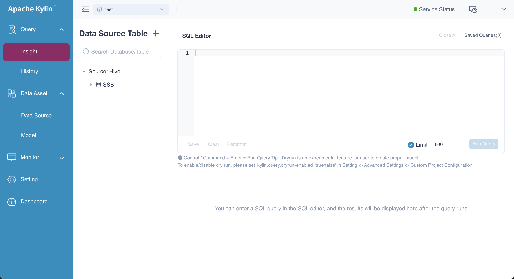
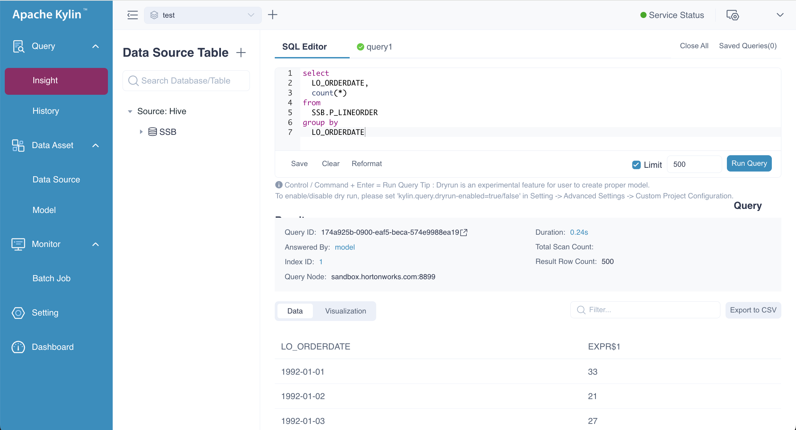
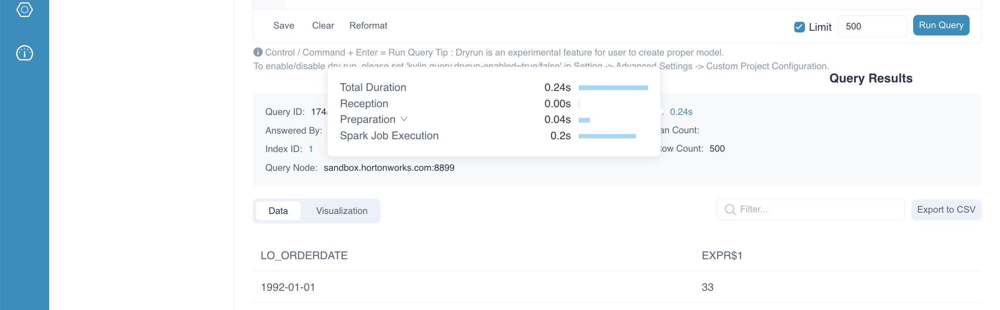
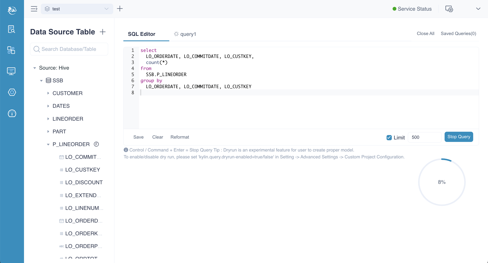
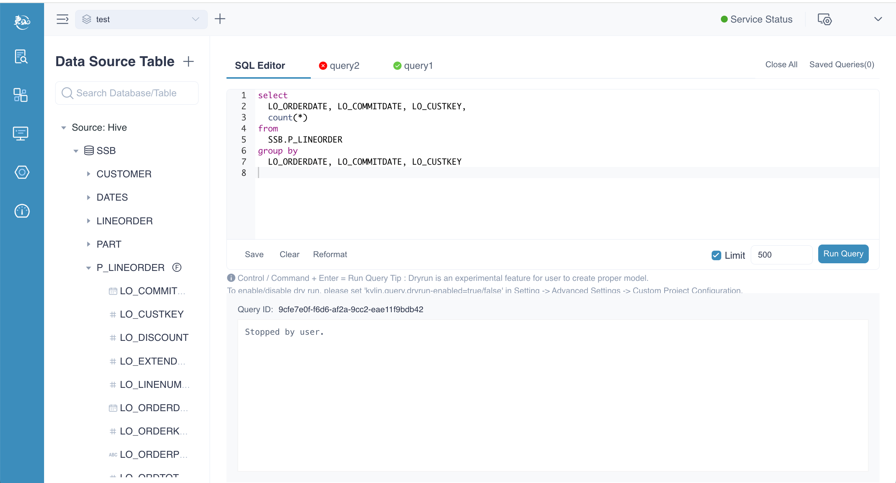
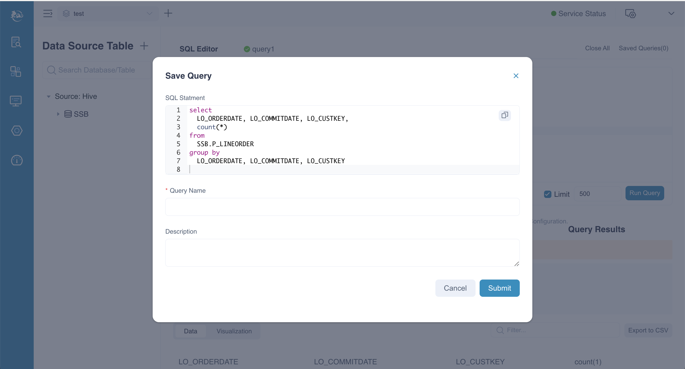
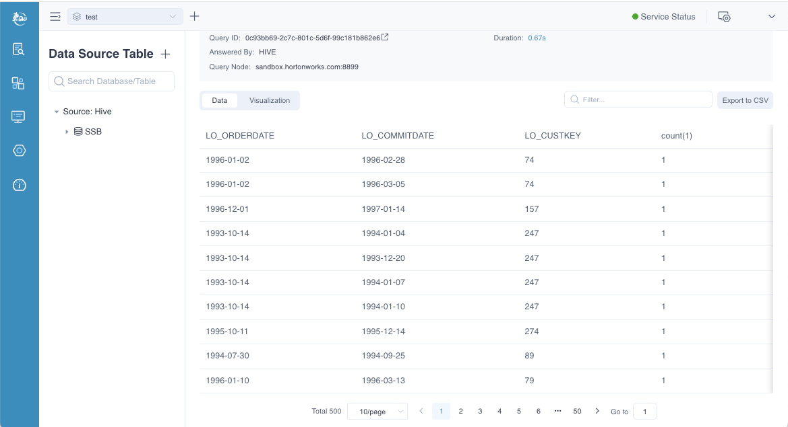
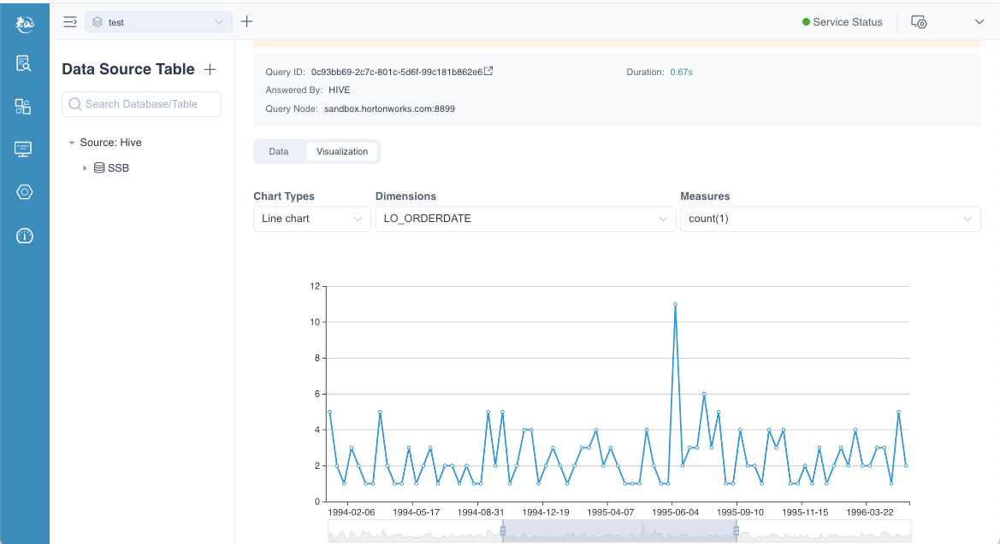
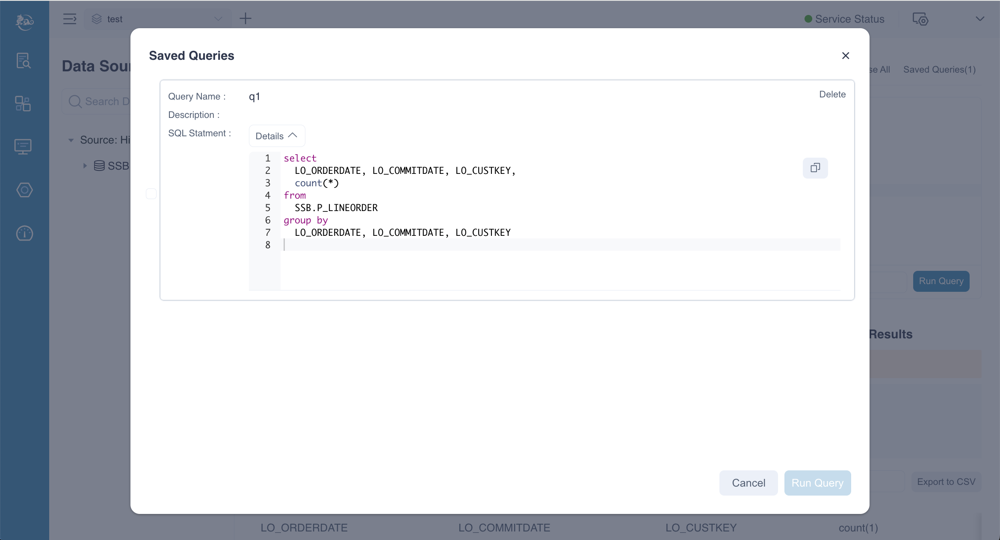

Kylin’s Intelligent OLAP Platform simplifies complex multidimensional analytics on massive datasets, achieving sub-second query response times through precomputation and index-building jobs. Unlike traditional methods that rely on real-time calculations, Kylin uses precalculated data to answer queries, significantly boosting performance. This innovative approach eliminates the need for real-time processing, delivering ultra-fast results and making Kylin an ideal solution for high-speed analytics.

This document describes how to use the Query Insight feature in Kylin.

### Overview

To access Kylin's Web UI, click on **Query -> Insight** in the navigation bar. All queryable tables will appear on the left side of the page. You can enter your SQL query in the text box on the right, and the query results will be displayed in the text box below.

### Run Query

To execute a query, enter a `SELECT` statement and click **Run Query** to view the results. You will notice a **Limit** field in the bottom right corner. If your SQL statement does not include a `LIMIT` clause, the system will automatically impose a default limit of 500 rows. To disable this limit entirely, you can uncheck the checkbox next to the limit field.

After the query results are successfully returned, you will notice that the query execution time is approximately 0.24 seconds, and the query has hit the model. Additionally, the query ID is followed by an arrow. Clicking this arrow will take you to the query's page in the Spark UI. On this page, you can easily observe the SQL execution details within Spark, providing insight into how the query was processed.

When optimizing slow queries, it's essential to analyze the specific execution steps to identify the root causes. To do this, hover your mouse over the **Durations** of the query. This action will display detailed execution steps along with their respective durations, helping you pinpoint the steps that may be contributing to the slow performance. By examining these details, you can better understand where optimization is needed.

:::tip Notices
1. Only query starts with **SELECT** or **EXPLAIN** are supported.
2. When query pushdown is enabled, queries that cannot be answered by the model (index group) will be routed to the pushdown engine for execution. In such cases, the query may take longer to return and could be executed by datasource(maybe Hive). Please refer to [Pushdown](push_down.md) for more details.
3. If the query does not require Spark computation, such as hitting the query cache or involves constant queries, there will be no arrow next to the query ID.
:::

### Stop Query

After clicking the **Run Query** button, you can stop the query by clicking the **Stop Query** button, which will appear in the same position. In this example, the query is pushed down to the Hive datasource. For more information, please refer to the [Pushdown](push_down.md) documentation.

After the query is stopped, query ID and error message will be displayed.

### Save Query

On the **SQL Editor** page, users can save queries by clicking the **Save** button in the bottom left corner. This action will trigger a pop-up window where you can enter a **Query Name** and a **Description**. Once you've filled in the details, click the **Submit** button to finish the saving process.

### Query Result

By default, Kylin displays query results in a table format. You can perform a fuzzy search for specific content using the Filter box at the top right of the query result. For example, if you enter "1992," each row in the query results that contains "1992" will be displayed, such as the daily order volume for the year 1992. Additionally, you have the option to export the query results to a CSV file.

However, you can click the **Visualization** button on the results page to display the query results in a chart format. The available chart types include line chart, bar chart, and pie chart. Below is an example of the query results displayed in a line chart format. You can also choose different dimensions and metrics to customize the data shown in the chart.

### Saved Query

Click the **Saved Queries** button at the top right of the SQL Editor to view all saved queries. A pop-up window will display a list of saved queries. By default, each query item is collapsed. To view the SQL, click the **Details** button next to the desired query. You can also check the box in front of a query and click the **Run Query** button to re-execute it.

