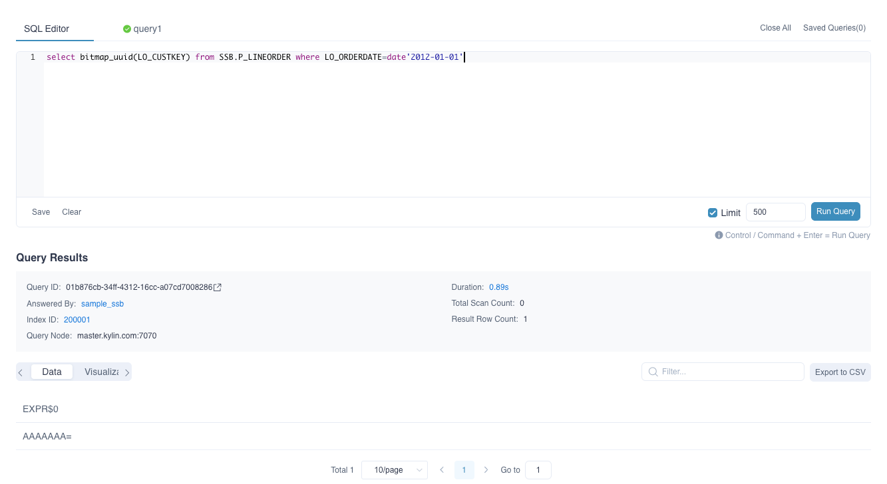
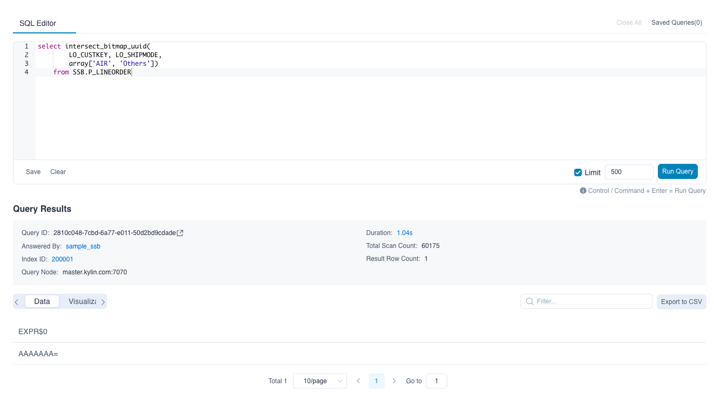
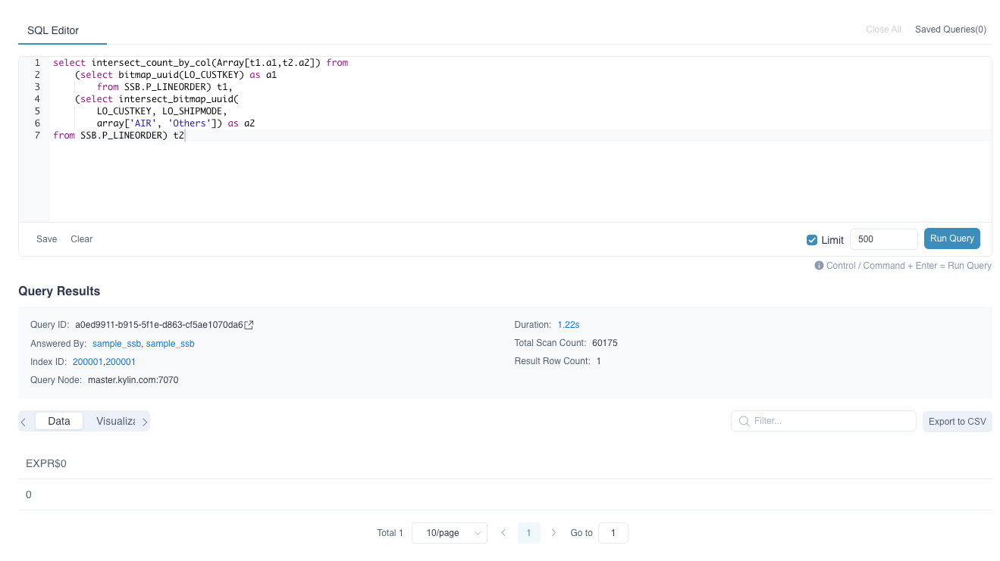

Users can use bitmap functions to operate de-duplication based on bitmap. Then find the intersection of the result bitmaps. 


### BITMAP_UUID

Syntax: BITMAP_UUID(column_to_count)

Description: Returning a string which points to a hidden serialized bitmap. The bitmap contains de-duplicated values and can be an input to other bitmap functions.

Parameters:
- `column_to_count`,  the column to be calculated and applied on distinct value, required to be added as **Precise count distinct** measure.
  
For example:
```sql
-- Return a string which points to a hidden serialized bitmap. The bitmap result is 
-- the de-duplicated seller id set of online transactions on New Year's Day. The bitmap 
-- can be used as an input to other bitmap functions.

select bitmap_uuid(LO_CUSTKEY) 
from SSB.P_LINEORDER 
where LO_ORDERDATE = date '2012-01-01'
```



### INTERSECT_BITMAP_UUID


Syntax: INTERSECT_BITMAP_UUID(column_to_count,  column_to_filter, filter_value_list)

Description: Returning a string which points to a hidden serialized bitmap. The bitmap contains the result of finding intersection based on filter column, and then de-duplicating based on count column.

Parameters:
- `column_to_count` ,  the column to be calculated and applied on distinct value required to be added as **Precise count distinct** measure.
- `column_to_filter`, the varied dimension. 
- `filter_value_list`,  the value of the varied dimensions listed in `array[]`, When `column_to_filter` is of type varchar, A single element in an array can map multiple values. By default, the '|' is split. You can set `kylin.query.intersect.separator` in `kylin.properties` to configure the separator, Can take value '|' or ',', default is '|'(Currently this parameter does not support the use of subquery results as parameters).

For example:
  
```sql
-- LSTG_FORMAT_NAME is a column of VARCHAR(4096) varied dimension.
--
-- Return a string which points to a hidden serialized bitmap. 
-- The bitmap result is the de-duplicated seller id set who have transactions 
-- in either type 'FP-GTC' and 'Others', or type 'FP-non GTC' or 'Others' 
-- on New Year's Day. The bitmap can be used as an input to other bitmap functions.

select intersect_bitmap_uuid(
      LO_CUSTKEY, LO_SHIPMODE,
      array['AIR', 'Others'])
from SSB.P_LINEORDER
```


When the data type of varied dimension is not varchar or integer, the values in 'filter_value_list' need to be explicitly cast, for example:
```sql
-- case 1
select 
    intersect_bitmap_uuid(column_to_count, 
                          column_to_filter, 
                          array[cast(3.53 as double), cast(5.79 as double)]) 
from TABLE_NAME;

-- case 2
select 
    intersect_bitmap_uuid(column_to_count, 
                          column_to_filter, 
                          array[TIMESTAMP'2012-01-02 11:23:45', TIMESTAMP'2012-01-01 11:23:45']) 
from TABLE_NAME;
```


### INTERSECT_BITMAP_UUID_V2

Syntax: intersect_bitmap_uuid_v2(column_to_count,  column_to_filter, filter_value_list, filter_type)

Description: Return a string which points to a hidden serialized bitmap. The bitmap contains the result of finding intersection based on filter column, and then de-duplicating based on count column. Support Regexp in condition.

Parameters:
- `column_to_count` ,  the column to be calculated and applied on distinct value required to be added as **Precise count distinct** measure.
- `column_to_filter`, the varied dimension. 
- `filter_value_list`,  the value of the varied dimensions listed in `array[]`,
- `filter_type`, the data type is String, which identifies the filter mode. There are currently two optional values "RAWSTRING" and "REGEXP". When the parameter value is "RAWSTRING", the filtering mode is precise filtering. When `column_to_filter` is a Varchar type, A single element in the array can be mapped with multiple values. By default, it is separated by '|'. You can use `kylin.query.intersect.separator` to configure the separator. And only support configuration in the `kylin.properties` file.  (currently this parameter does not support using the results of subqueries as parameters). When the parameter value is "REGEXP", the filtering mode is regular matching, and only the value of the regular expression in column_to_filter that can match the filter_value_list will be filtered.

For example:
``` sql
-- LSTG_FORMAT_NAME is a column of VARCHAR(4096) varied dimension.
--
-- Return a string which points to a hidden serialized bitmap. 
-- The regular expression can match 'FP-GTC', 'FP-non GTC' and 'Others', 
-- The bitmap result is the de-duplicated seller id set who have transactions 
-- in either type 'FP-GTC' and 'Others', or type 'FP-non GTC' or 'Others' 
-- on New Year's Day. The bitmap can be used as an input to other bitmap functions.

select intersect_bitmap_uuid_v2(
      LO_CUSTKEY, LO_SHIPMODE,
      array['A*R', 'Other.*'], 'REGEXP')
from SSB.P_LINEORDER
```


When the filter_type is "RAWSTRING" and the data type of varied dimension is not varchar or integer, the values in 'filter_value_list' need to be explicitly cast, for example:
```sql
-- case 1
select 
    intersect_bitmap_uuid_v2(column_to_count, 
                             column_to_filter, 
                             array[cast(3.53 as double), cast(5.79 as double)], 'RAWSTRING') 
from TEST_TABLE;

-- case 2
select 
    intersect_bitmap_uuid_v2(column_to_count, 
                             column_to_filter, 
                             array[TIMESTAMP'2012-01-02 11:23:45', 
                                   TIMESTAMP'2012-01-01 11:23:45'], 'RAWSTRING') 
from TEST_TABLE;
```


### INTERSECT_COUNT_BY_COL

Syntax: intersect_count_by_col(Array[t1.c1,t2.c2 ...])

Description: Find the intersection of the serialized input bitmaps. Then return the distinct count.

Parameters:
- `t1.c1, t2.c2 ...`, the list of input columns. Each column points to a serialized bitmap hidden from users. Function `bitmap_uuid` and `intersect_bitmap_uuid`  and `intersect_bitmap_uuid_v2` can return the bitmap.
  
For example:
```sql
-- Function `bitmap_uuid` and `intersect_bitmap_uuid` return two serialized bitmap. 
-- `intersect_count_by_col` then find the intersection on two bitmaps 
-- and return distinct count.

select intersect_count_by_col(Array[t1.a1, t2.a2])
from (select bitmap_uuid(LO_CUSTKEY) as a1 from SSB.P_LINEORDER) t1,
     (select intersect_bitmap_uuid(LO_CUSTKEY, LO_SHIPMODE, array['AIR', 'Others']) as a2
      from SSB.P_LINEORDER) t2
```


### Limitations

**All the above functions don't support pushdown query**
