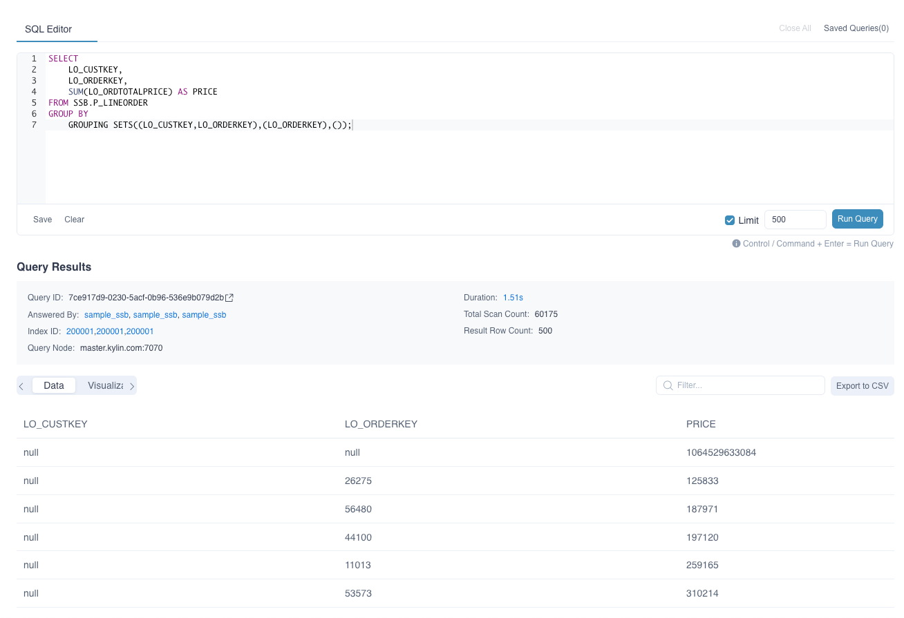
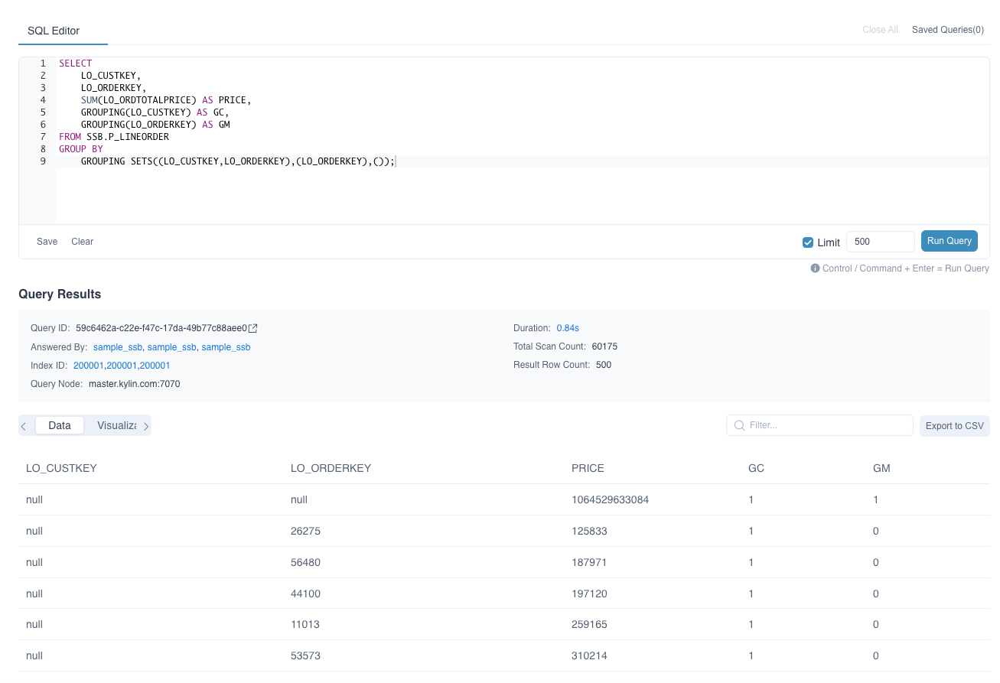
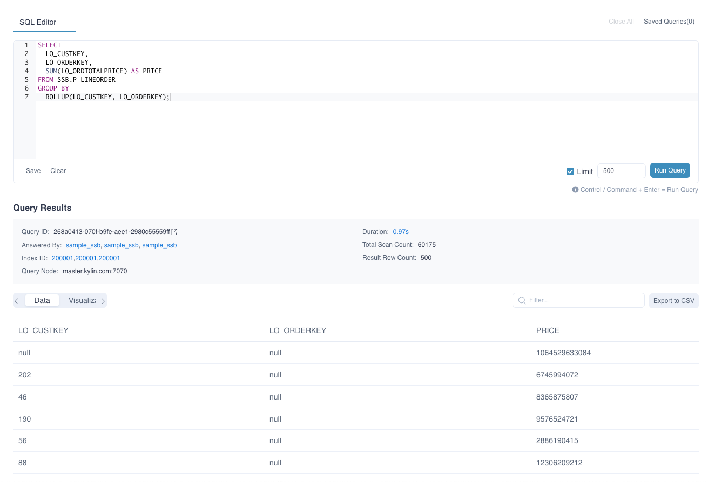

Users can utilize grouping functions to aggregate data by different keys within a single SQL statement. ROLLUP, CUBE, and GROUPING SETS are commonly used grouping and aggregate methods. CUBE and ROLLUP functions can be considered special cases of GROUPING SETS.

**Note that, in the current version, grouping functions are not supported as computed columns.**


### GROUPING SETS(expression)

In a result set, you sometimes need to aggregate columns A and B separately, and also aggregate the two columns together. The implementation method is often to use multiple UNION ALL statements. However, the GROUPING SETS function can use different grouping settings for aggregate queries at the same time. It can replace multiple UNION ALL statements, making SQL statements more convenient and efficient.

The GROUPING SETS function is often used in the GROUP BY clause. The expression is filled with the combination of dimensions that need to be grouped. For example, GROUPING SETS ((A, B), (C), ()) means to do aggregation with both columns A and B, aggregation with column C and aggregation with no grouping.

For example:
```sql
SELECT LO_CUSTKEY, LO_ORDERKEY, SUM(LO_ORDTOTALPRICE) AS PRICE
FROM SSB.P_LINEORDER
GROUP BY GROUPING SETS((LO_CUSTKEY,LO_ORDERKEY),(LO_ORDERKEY),());

-- the equivalent sql
SELECT LO_CUSTKEY, LO_ORDERKEY, SUM(LO_ORDTOTALPRICE) AS PRICE
FROM SSB.P_LINEORDER
GROUP BY LO_CUSTKEY, LO_ORDERKEY

UNION ALL
SELECT NULL AS LO_CUSTKEY, LO_ORDERKEY, SUM(LO_ORDTOTALPRICE) AS PRICE
FROM SSB.P_LINEORDER
GROUP BY LO_ORDERKEY

UNION ALL
SELECT NULL AS LO_CUSTKEY, NULL AS LO_ORDERKEY, SUM(LO_ORDTOTALPRICE) AS PRICE
FROM SSB.P_LINEORDER;

```




### GROUPING(expression)

In the results generated by grouping functions, `NULL` is used as a placeholder. As a result, it can be difficult to distinguish between `NULL` as a placeholder and `NULL` as part of the original data.

The `GROUPING` function helps differentiate between these two cases. It identifies whether a `NULL` value in the result set is a placeholder or actual data.

The columns involved in grouping can be passed into the `GROUPING` function. If the function returns `0`, the `NULL` value in the corresponding row comes from the original data. If it returns `1`, the `NULL` is a placeholder introduced by the grouping function.

For example:
```sql
SELECT 
	LO_CUSTKEY,
	LO_ORDERKEY,
	SUM(LO_ORDTOTALPRICE) AS PRICE,
	GROUPING(LO_CUSTKEY) AS GC,
	GROUPING(LO_ORDERKEY) AS GM
FROM SSB.P_LINEORDER
GROUP BY 
	GROUPING SETS((LO_CUSTKEY,LO_ORDERKEY),(LO_ORDERKEY),());
```

You can see that the result of the GROUPING function in both columns in the first row is 1, indicating that the NULL in the two columns LO_CUSTKEY and LO_ORDERKEY in this row are placeholders due to the GROUPING SETS function.




### CUBE(expression)

`CUBE` performs group aggregation on all specified columns and ultimately provides the overall total aggregation result. The columns used in the expression are expanded into all possible combinations. For example, `GROUP BY CUBE (a, b, c)` is equivalent to `GROUPING SETS ((a, b, c), (a, b), (a, c), (b, c), (a), (b), (c), ())`.


### ROLLUP(expression)

`ROLLUP` performs group aggregation starting with the first column and ultimately provides the overall total aggregation. The columns in the expression are broken down into hierarchical combinations. For example, `GROUP BY ROLLUP (a, b, c)` is equivalent to `GROUPING SETS ((a, b, c), (a, b), (a), ())`.

For example:
```sql
SELECT
  LO_CUSTKEY,
  LO_ORDERKEY,
  SUM(LO_ORDTOTALPRICE) AS PRICE
FROM SSB.P_LINEORDER
GROUP BY
  ROLLUP(LO_CUSTKEY, LO_ORDERKEY);
```


