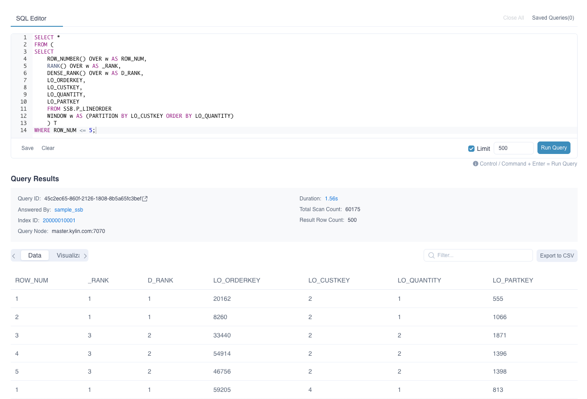
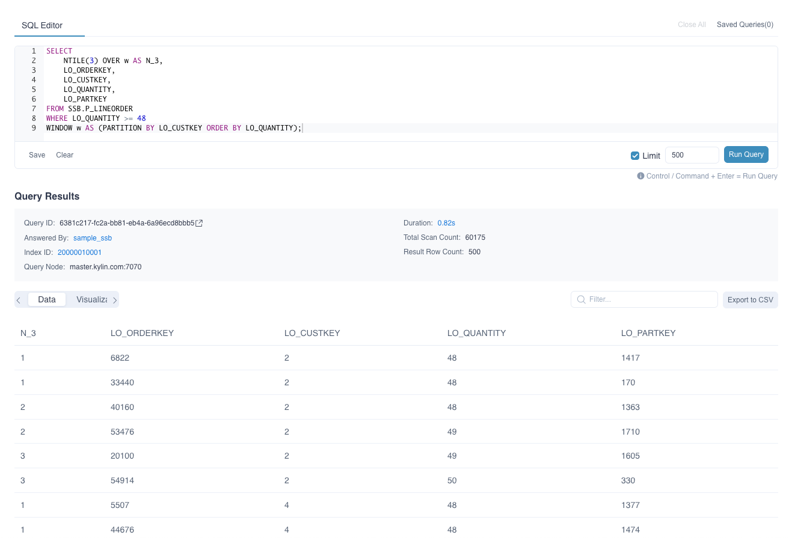
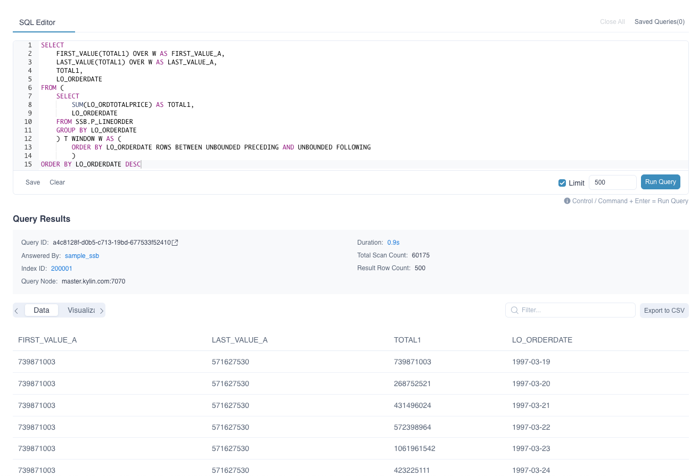
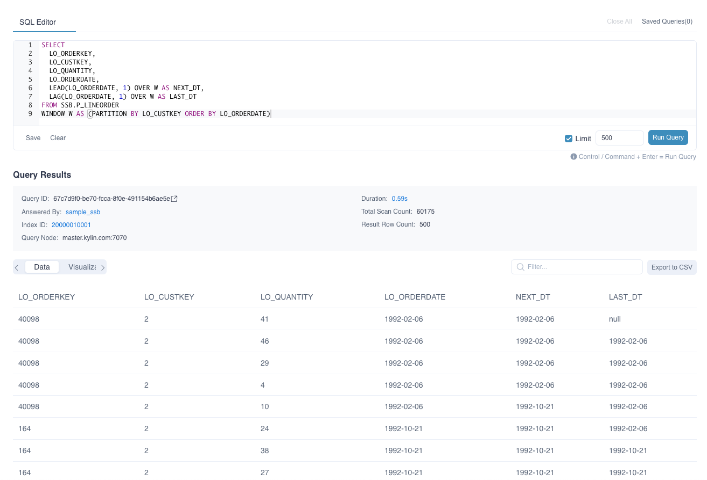

Window functions are a powerful tool that can simplify complex queries and improve performance. They allow you to perform calculations on a set of rows that are related to the current row, such as finding the sum or average of values in a specific range.

**Window functions are not supported for defining or recommending computed columns.**

### Syntax Structure

The basic syntax for using a window function is as follows:
```sql
function(value) OVER window
```

#### Window Clause
A window consists of three clauses:

* `partition by`: a group clause that defines the calculation range of the window function.
* `order by`: a sort clause that specifies the sorting method within the group after partition.
* `rows/range`: a window clause that determines a sliding data window within the group.
  ```sql
  -- rows is a physical window that selects a fixed number of rows before and after 
  -- the current row number, based on the `order by` clause. The result is independent 
  -- of the current row's value, but rather its sorted row number.
  sum(columnA) rows between 1 preceding and 2 following;
  -- Explain: If the current row's `columnA` has a sorted row number of 3, this clause  
  -- selects rows with sequence numbers between 2 and 5.
  
  
  -- range is a logical window that selects a fixed number of rows before and after 
  -- the current row's value. The result is independent of the sorted row number, but 
  -- rather the row's value.
  sum(columnA) range between 1 preceding and 2 following;
  -- Explain: If the current row's `columnA` value is 3, this clause selects rows with  
  -- values between 2 and 5.
  
  ```

If an **order by** clause is specified without a window clause, the default window clause is equivalent to **range between unbounded preceding and current row**.
#### Function Part

1. **ROW_NUMBER()**: Returning the position of the current row in its partition, the sequence numbers are not repeated.
2. **RANK()**: Returning the position of the current row in its partition, possibly with sequence gaps.
3. **DENSE_RANK()**: Returning the position of the current row in its partition, with no sequence gaps.
4. **NTILE(value)**: Returning an integer ranging from 1 to value, dividing the partition as equally possible.
5. **FIRST_VALUE(value)**: Returning value evaluated at the row that is the first row of the window frame.
6. **LAST_VALUE(value)**: Returning value evaluated at the row that is the last row of the window frame.
7. **LAG(value, offset, default)**: Returning the forward offset of the current row in the partition. *value* represents the field as the column value, *offset* represents the number that needs to be looked up in the offset row forwards based on the current value, *default* represents the value returned by default when there is no eligible value, and null is returned by default if not filled.
8. **LEAD(value, offset, default)**: Returning the offset row backwards from the current row in the partition. *value* represents the column as the current value, *offset* represents the number that needs to be searched for the offset row backwards based on the current value, and *default* represents the value returned by default when there is no eligible value, and null is returned by default if not filled.


### Examples

The following examples demonstrate the usage of window functions with the *P_LINEORDER* table from the [sample dataset](../../quickstart/tutorial.md). This dataset includes field descriptions for reference.


#### Example 1: Ranking
Using **RANK ()**, **DENSE_RANK ()**, and **ROW_NUMBER ()** in a single query to retrieve the first five orders with the least number of items purchased by each buyer. The query is as follows:

  ```sql
  SELECT *
  FROM (
  SELECT 
      ROW_NUMBER() OVER w AS ROW_NUM,
      RANK() OVER w AS _RANK,
      DENSE_RANK() OVER w AS D_RANK,
      LO_ORDERKEY,
      LO_CUSTKEY,
      LO_QUANTITY,
      LO_PARTKEY
      FROM SSB.P_LINEORDER 
      WINDOW w AS (PARTITION BY LO_CUSTKEY ORDER BY LO_QUANTITY)
      ) T
  WHERE ROW_NUM <= 5;
  ```


For a buyer with id '1', the following ranking scenarios are observed:

* **row_number() Function**
  * Orders with *LO_QUANTITY* = 1 are ranked sequentially: 1, 2, 3, 4
  * The order with *LO_QUANTITY* = 2 is ranked as 5

* **rank() Function**
  * Orders with *LO_QUANTITY* = 1 are ranked equally: 1, 1, 1, 1
  * The order with *LO_QUANTITY* = 2 is ranked as 5, resulting in sequence gaps

* **dense_rank() Function**
  * Orders with *LO_QUANTITY* = 1 are ranked equally: 1, 1, 1, 1
  * The order with *LO_QUANTITY* = 2 is ranked as 2, with no sequence gaps


#### Example 2: NTILE

The orders of each buyer are divided into 3 groups according to the number of purchased products. In order to display the search results completely, the orders with the number of products greater than or equal to 48 are selected for grouping.

  ```SQL
  SELECT 
      NTILE(3) OVER w AS N_3,
      LO_ORDERKEY,
      LO_CUSTKEY,
      LO_QUANTITY,
      LO_PARTKEY
  FROM SSB.P_LINEORDER
  WHERE LO_QUANTITY >= 48
  WINDOW w AS (PARTITION BY LO_CUSTKEY ORDER BY LO_QUANTITY);
  ```



#### Example 3: First and Last Value
Query the first order and the last order with the highest total price sorted by date.

  ```SQL
  SELECT 
      FIRST_VALUE(TOTAL1) OVER W AS FIRST_VALUE_A,
      LAST_VALUE(TOTAL1) OVER W AS LAST_VALUE_A,
      TOTAL1,
      LO_ORDERDATE
  FROM (
  	SELECT 
  	    SUM(LO_ORDTOTALPRICE) AS TOTAL1,
  	    LO_ORDERDATE
  	FROM SSB.P_LINEORDER
  	GROUP BY LO_ORDERDATE
  	) T WINDOW W AS (
  		ORDER BY LO_ORDERDATE ROWS BETWEEN UNBOUNDED PRECEDING AND UNBOUNDED FOLLOWING
  		)
  ORDER BY LO_ORDERDATE DESC
  ```



#### Example 4: Lead and Lag
Query the time of last order and next order based on current order.

  ```SQL
  SELECT
    LO_ORDERKEY,
    LO_CUSTKEY,
    LO_QUANTITY,
    LO_ORDERDATE,
    LEAD(LO_ORDERDATE, 1) OVER W AS NEXT_DT,
    LAG(LO_ORDERDATE, 1) OVER W AS LAST_DT
  FROM SSB.P_LINEORDER
  WINDOW W AS (PARTITION BY LO_CUSTKEY ORDER BY LO_ORDERDATE)
  ```


