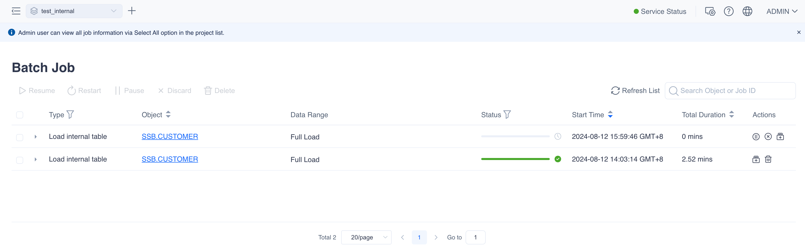

### Full Import

All internal tables, whether partitioned or not, support full data import.
Full import is suitable for tables with a moderate amount of data. If the table has a particularly large amount of data and a time partition column is set, it is recommended to use incremental import.
Hover your mouse over the table you want to import data into and click the data import button. 

For full import, there is no need to select a time range, the system will import all data from the data source table into the internal table.

### Incremental Import

Only tables with a time partition column set support incremental import. When performing incremental import, you can set the start and end times for the import. The system will pull data from the data source within this time range and import it into the internal table.

Please note: Internal tables do not have unique key constraints or duplicate data checks. If the time range of the data you import overlaps, duplicate data may occur. If you wish to update certain partition data, you can delete the data of that partition and re-import it.

### Data Import Tasks

After submitting the data import task request, you can view the running data import tasks and their progress, status, and logs in "Monitoring" -> "Batch Data Tasks".

